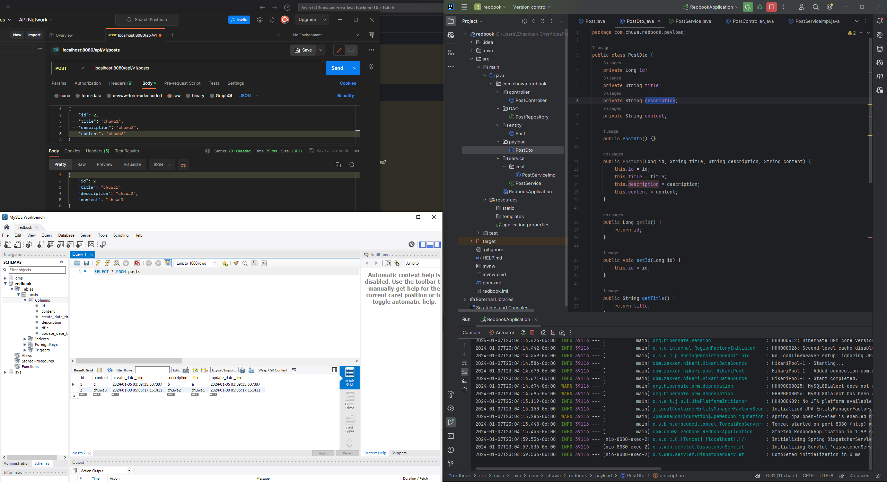

# 1
See annotations.md

# 2
```
@Column(columnDefinition = "varchar(255) default 'John Snow'")
private String name;
```
specifies the details of the column to which the name field will be mapped in the database.
The variable name is mapped to a database column of tpye `varchar(255)` with a default value of `John Snow`.
```
@Column(name="STUDENT_NAME", length=50, nullable=false, unique=false)
private String studentName;
```
The variable studentName is mapped to the `STUDENT_NAME` column in the database. The length of the column is 50, the column cannot have null value, and the column may contain duplicate values.

# 3
The default column names are set to be the same as the variable if not specified. So the column names will be `firstName` and `operatingSystem`.

# 4
1. Presentation Layer: Handles HTTP requests, processes them (with the help of other layers), and returns the appropriate response. This layer is usually implemented with classes annotated with @RestController or @Controller in a web application.
2. Business Layer: Contains the business logic of the application. It's responsible for executing specific business rules and functions.
3. Persistence Layer: The persistence layer contains all the storage logic and translates business objects from and to database rows.
4. Database Layer: In the database layer, CRUD (create, retrieve, update, delete) operations are performed.

# 5 
The request goes to the controller, and the controller maps that request and handles it. After that, it calls the service logic if required. In the service layer, all the business logic performs. It performs the logic on the data that is mapped to JPA with model classes. A JSP page is returned to the user if no error occurred.

# 6 
application.properties is a configuration file used in Spring Boot applications. It uses the standard properties file format, which is simple and line-oriented. Each configuration is written in the form of key-value pairs, separated by an equals sign. For example: server.port=8080.

application.yml is also a configuration file but with different format. It is particularly preferred when dealing with complex hierarchical configurations due to its readability and structure.

# 7
See /CodingQuestions/1.8/mongo-blog