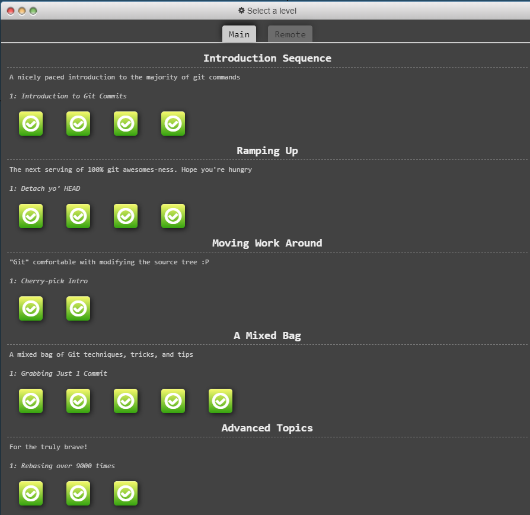
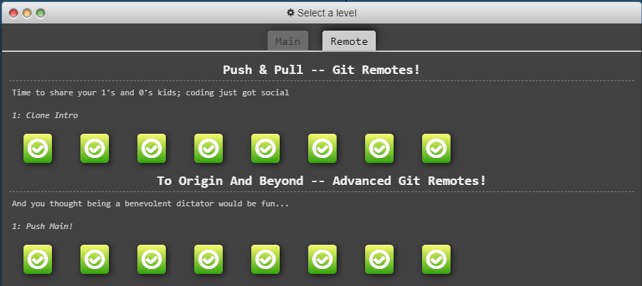

# Assignment 1

1. 
    - Styling text
        - **Bold**
        - *Italic*
        - ~~Strikethrough~~
        - **Bold and _italic_**
        - ***All bold and italic***
        - Here is <sub>subscript</sub>
        - Here is <sup>superscript</sup>
    - Quote Text
        - > Here is quote
    - Quote Code
        - Here is quote code `git status`
        -   ```
            blocks of quote code
            git init
            git add .
            git commit -m "Hello world"
            git push origin main
            ```
    - Color Models
        - Color Models works in PR, discussions and issues. `#f03c15`, `rgb(9, 105, 218)`, `hsl(H,S,L)`
    - Links
        - [My GitHub Homepage](https://github.com/frank-z-chen)
    - Lists
        - Unordered List
            - Nested List
                1. Numbered List
                2. Numbered List
                3. Numbered List
    - Task Lists
        - [x] Task completed
        - [ ] Task not completed

2. 
```
git commit
git branch
git checkout
git checkout -b <branch name>
git init
git add .
git merge
git rebase
git rebase -i
git cherry-pick
Relative ref (^ and ~) and chaining
git reset
git revert
git tag
git describe
git clone
git push
git pull
git fetch
git fork
```



3. `git init`
4. `git clone <link to repo>`
5.  `git branch <branch name>; git checkout <branch name>`
    
    or
    
    `git checkout -b <branch name>` 
6. `git checkout master; git merge branch_test`
7. - In Git Bash: Use `git stash` to stash changes and use `git stash pop` to pop stash back.
   - In Intellij: 
     - To stash: git > Uncommitted Changes > Stash Changes... > Enter Message > Create Stash
     - To pop stash: git > Uncommitted Changes > Unstash Changes... > Check Pop stash > Click Pop Stash
8. PR is essentially a git merge with additional functioanilties. With PR, other contributors may do code reviews and comment on the PR and admins may approve the PR.
9. Maven is a build automation tool for Java projects. Maven manages how software is built and its dependencies. 
10. Clean -> Validate -> Compile -> Test -> Package -> Verify -> Install -> Deploy
- Clean: Remove all files generated by the previous build.
- Validate: Validates if all necessary information is available and correct.
- Compile: Compiles the source code of the project.
- Test: Tests the compiled source code using a suitable unit testing framework such as JUnit.
- Package: Takes the compiled code and packages it in its distributable format, such as a JAR or WAR.
- Verify: Runs any checks to verify the package is valid and meets quality criteria.
- Install: Installs the package into the local/remote repository, which can be used as a dependency in other projects locally.
- Deploy: Copies the final package to the remote repository for sharing with other developers and projects.
11. **Package** takes the compile code and packages it in its distribution format whereas **Install** will install the package to local/remote repo.
12. - Maven plugins are ways of adding functionalities to Maven build process. A plugin is a collection of one or more goals (tasks) that can be executed at different phases of the Maven lifecycle. Plugins allow for the customization and extension of the default behavior of Maven.
        - Maven Compiler Plugin (maven-compiler-plugin): This plugin is used for compiling Java sources. It's one of the core plugins and is typically used in the compile phase.
        - Maven Jar Plugin (maven-jar-plugin): Used for creating JAR files. It's commonly invoked during the package phase to package compiled code.
13. Checkout Repo/MavenProject
14. Do CR.
