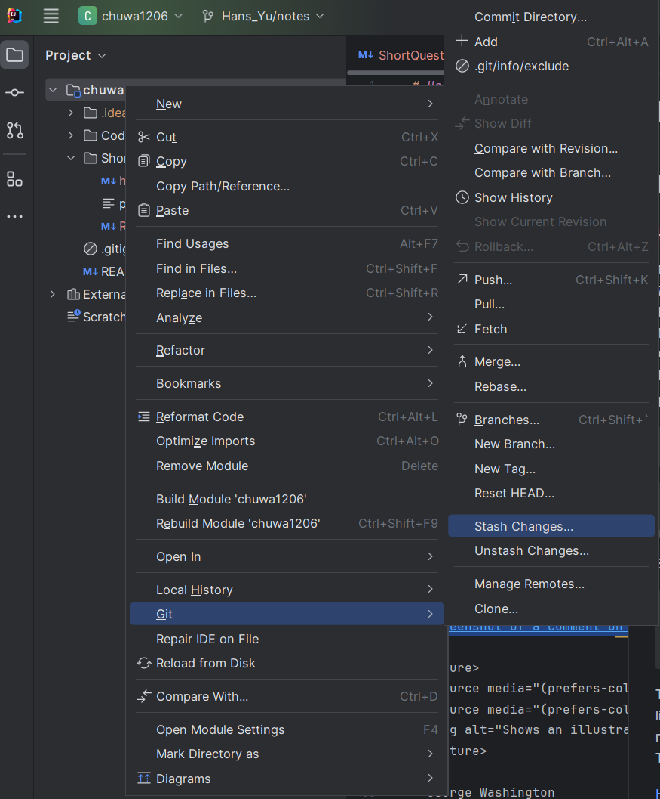
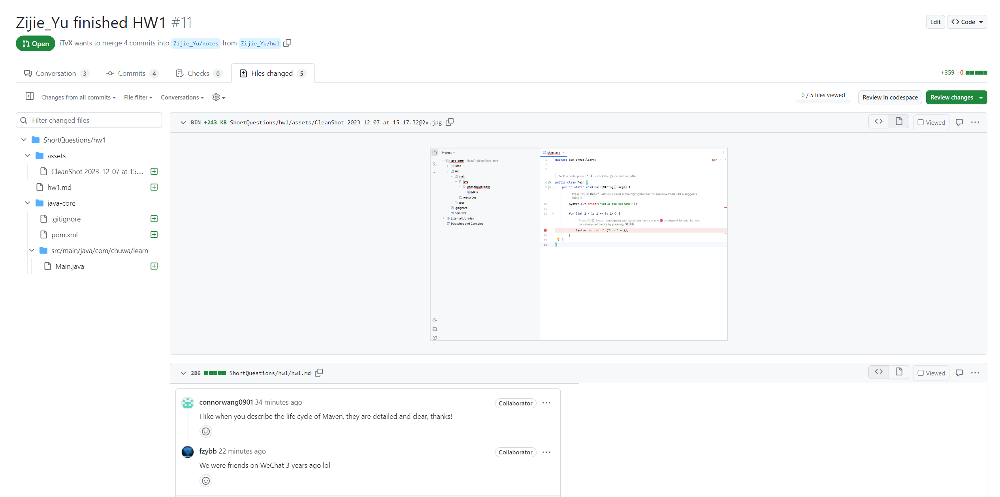

#### 1.  Learn **MarkDown** and show all of basic usage in the **ShortQuestions/README.md**
[Open the README](./README.md)
#### 2.  practice git using the platform. list the git commands you learned

    git commit
    git checkout
    git branch
    git merge
    git rebase
    git cherry-pick
    git reset
    git revert
    git tag
    git clone
    git push
    git pull
    git fetch
    git fork

#### 3.  What is the basic steps to init a git repo in you local ?
    git init
    git add .
    git commit -m "Initial commit"

#### 4.  How to clone a repo from Github ?

    git clone git clone https://github.com/Liam-Zhou/chuwa1206
#### 5.  How to create a new branch and checkout to that branch ?

    git checkout -b Hans_Yu/hw1
#### 6.  How to merge the branch_test to master branch in command ? show me the commands

    git checkout master
    git merge branch_test
#### 7.  How to **stash** your new code before leaving branch **branch_learn_stash** and pop your stash when you checkout back to **branch_learn_stash** ? try commands way and intellij way.
    git stash
    git stash list
    git stash pop

#### 8.  How do you understand **PR is based on Branch**?  
  a pull request (PR) is a method of submitting contributions to a project, it is the mechanism for merging a branch's changes into another branch.   
  We mainly make use of PR in the following sequence:  
  1. Branch Creation  
  2. Commits  
  3. Pushing to Remote  
  4. Creating the PR  
  5. Code Review and Discussion  
  6. Merging  

#### 9.  What is **maven** role ? what it be used to do ?  
  Maven is a tool used for building and managing Java-based projects. It simplifies processes like compiling code, managing libraries and dependencies, and packaging the output into JAR files. Maven uses a pom.xml file to define the project structure, dependencies, and build configuration.
#### 10.  What is the **lifecycle** of maven? could you tell me the details ?
- `validate` : Check if all information necessary for the build is available.  
- `compile` : Compile the source code of the project. 
- `test` : Run tests using a suitable unit testing framework. These tests should not require the code to be packaged or deployed. 
- `package` : Take the compiled code and package it in its distributable format, such as a JAR. 
- `verify` : Run any checks to validate the package is valid and meets quality criteria. 
- `install` : Install the package into the local repository, for use as a dependency in other projects locally. 
- `deploy` : Done in an integration or release environment, copies the final package to the remote repository for sharing with other developers and projects.

#### 11.  what is the difference between **package** and **install** in maven lifecycle ?
- `Package` : This phase takes the compiled code and other resources (like properties files, images, etc.) and packages them into a distributable format, such as a JAR, WAR, or EAR file.It simply creates the package that can be distributed or deployed.

- `Install` : During the install phase, the package created during the package phase is installed into the local Maven repository on your machine. This makes the package available as a dependency for other projects that you might be working on locally.

  So, the basic difference between `Package` and `Install` is whether you want to make it available to other projects on your system.
#### 12.  What is **plugins** in maven, list some plugins.
  a plugin is a collection of one or more goals (executions tasks) that can be executed during the build lifecycle. They are used to perform specific tasks that are outside of the default Maven build phases.  
  Some commonly used Maven plugins include:

- `Maven Compiler Plugin (maven-compiler-plugin)`: Compiles Java source code.

- `Maven Surefire Plugin (maven-surefire-plugin)`: Used during the test phase to run unit tests.

- `Maven JAR Plugin (maven-jar-plugin)`: Packages the project as a JAR file.

- `Maven WAR Plugin (maven-war-plugin)`: Used for web applications to create a WAR file.

- `Maven Clean Plugin (maven-clean-plugin)`: Cleans up after the build, removing the target directory.

- `Maven Install Plugin (maven-install-plugin)`: Installs the artifact into the local repository.

- `Maven Deploy Plugin (maven-deploy-plugin)`: Deploys the final package to a remote repository.

- `Maven Dependency Plugin (maven-dependency-plugin)`: Analyzes and modifies dependencies.
#### 13.  In **Repo/MavenProject** directory, create a **maven Module** using Intellij, named it as belows:  
    groupID: com.chuwa.learn
    artifactID: java-core
[Java Core](../Repo/MavenProject/java-core/)

#### 14.  Do Code Review: Go over the PRs in your repo, tried to leave some useful or useful comments in other students' PR, please don't merge it.

