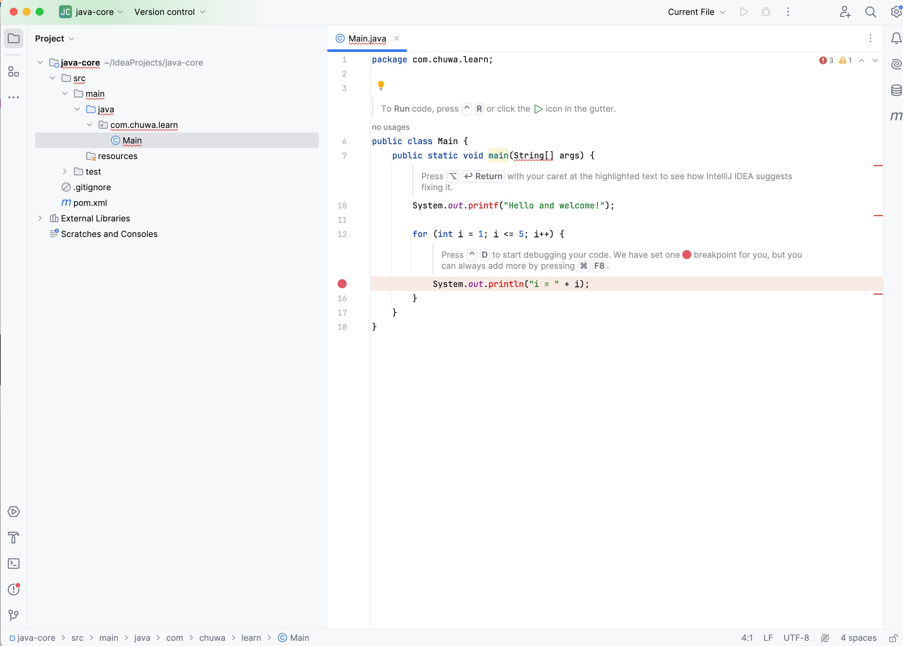

Name: Zijie Yu (Cyril Yu)

Date: 12/07/2023


# 1. Learn MarkDown and show all of basic usage in the ShortQuestions/README.md

没有在ShortQuestions文件夹内找到README.md，因为平常我自己用md写文档也比较多，那么就记录一下平常不经常使用容易忘的：

## “* *” 是斜线

例子：*这是斜线*


## “~~ ~~”是删除

例子：~~已经被删除了~~


## unordered list是“-”

- list 1
- list 2
- list 3
  - nested list


## task list是“- [ ]"

- [ ] 作业完成了
- [x] 作业暂时还没有完成


## 其它

### Footnotes

``` markdown
Here is a simple footnote[^1].

A footnote can also have multiple lines[^2].

[^1]: My reference.
[^2]: To add line breaks within a footnote, prefix new lines with 2 spaces.
  This is a second line.
```


### Heading

```markdown
# A first-level heading
## A second-level heading
### A third-level heading
```


```markdown
Text that is not a quote

> Text that is a quote
```


### Quoting code

Use `git status` to list all new or modified files that haven't yet been committed.


### Supported color models

```markdown
The background color is `#ffffff` for light mode and `#000000` for dark mode.
```


### Image


``` Markdown

```


# practice git using the platform. list the git commands you learned

## 初始化

git init

## 添加文件

git add <文件名>
git add .

## 提交

git commit -m "提交说明"

## 查看状态

git status

## 查看日志

git log

## 回退版本

git reset --hard HEAD^
git reset --hard <版本号>

## 分支

git checkout -b <分支名>
git checkout <分支名>
git merge <分支名>
git mergetool

## 远程

git clone <远程地址>
git push origin <分支名>
git pull origin <分支名>

## 其他

git diff
git difftool
git stash
git reset
git revert


# 2

What is the basic steps to init a git repo in you local ?


run `git init`, after add files, use `git add .` add all files, the do the `git commit -m "initial commit`, then `git push` to GitHub.

# 3

How to clone a repo from Github ?

Find github ssh or https, copy it. Then `git clone (add pastes ssh)`


# 4

How to create a new branch and checkout to that branch ?

`git checkout -b newBranch`

# 5

How to merge the branch_test to master branch in command ? show me the commands

checkout out to the main branch, then `git merge branch_tesh`

# 6

How to stash your new code before leaving branch branch_learn_stash and pop your stash when you checkout back to **branch_learn_stash ? try commands way and intellij way.

## git commands

`git stash "save message"`

`git checkout other_branch`

`git checkout branch_learn_stash`

`git stash pop`

## IntelliJ

go to `VCS` -> `Git` -> `Stash Changes`.

To switch branches, go to the bottom-right corner, click on the Git branch name, and select the branch we want to switch to.

- Switch back to `branch_learn_stash` using the branch selector at the bottom-right corner.
- Open the `VCS` menu, go to `Git`, and then to `Unstash Changes`.
- Select the stash we want to apply and click `Pop`.


# 7

How do you understand PR is based on Branch?

就是一般从主分支里面拉取一个自己的分支，然后在这个分支上干活，弄完之后上传自己的分支。那么这个时候，主分支和我自己的这个分支就存在了差别，我就可以去github创建一个pull request。一旦这个pull request通过之后，这个分支就可以合并到主分支里面来了，然后可以把这个pull request关掉了。


# 8

What is maven role ? what it be used to do ?

Maven is a software project management tool, primarily used for Java projects. It automates the build process, manages dependencies by downloading necessary libraries, ensures project standardization, and supports testing automation. Maven is known for its project lifecycle management and plugin-based architecture, which integrates well with continuous integration and delivery systems.


# 9

What is the lifecycle of maven? could you tell me the details ?

The lifecycle of Maven is a central part of its build process, defining the phases of the build. Maven has three main built-in lifecycles: `default`, `clean`, and `site`.

**Clean Lifecycle**: This lifecycle is intended to clean the project, ensuring no residual files from previous builds. 

**Default Lifecycle**: This is Maven's primary lifecycle, used for the actual project build and deployment. 

**Site Lifecycle**: Used for creating the project's site documentation. 


# 10

what is the difference between package and install in maven lifecycle ?

Packaging is about turning the code into a complete file, while installation is about placing this file in a location that is easily accessible to other projects.

# 11

What is plugins in maven, list some plugins.

In Maven, plugins are the primary way of adding functionality to the build process. 

**Maven Compiler Plugin**

**Maven Surefire Plugin**

**Maven Failsafe Plugin**

**Maven WAR Plugin**

**Maven JAR Plugin**


# 12

In Repo/MavenProject directory, create a maven Module using Intellij, named it as belows:

1. groupID: com.chuwa.learn

2. artifactID: java-core





