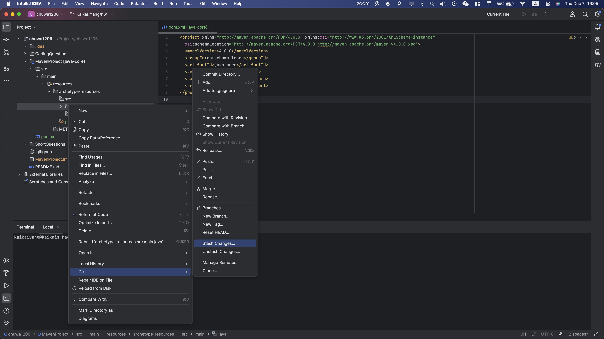
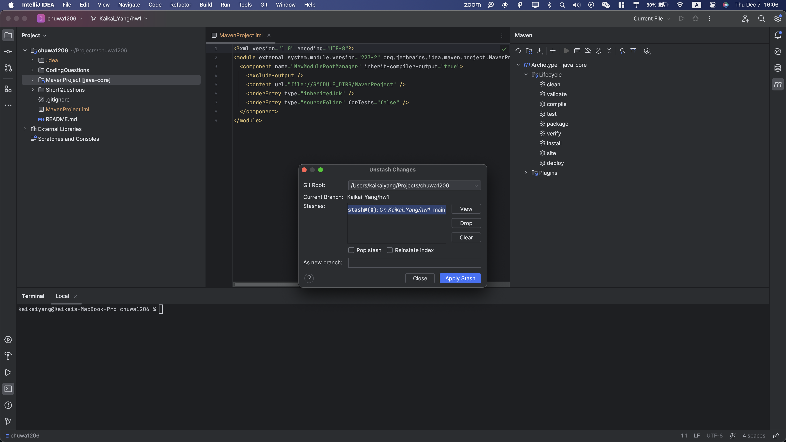

### 1. usage of md

- are shown in this file


### 2. list the git commands you learned

```bash
git commit
git branch bugFix
git checkout bugFix
git merge bugFix
git pull
git push
git rebase
git reset
git clone
git cherry-pick
git revert
git fetch
git fork
```


### 3. What is the basic steps to init a git repo in you local

```bash
cd /path_to_dir
git init
git add .
git commit -m "Initial commit"
```

### 4. How to clone a repo from Github 

```bash
git clone https://github.com/Liam-Zhou/chuwa1206.git
```

### 5. How to create a new branch and checkout to that branch 

```bash
git branch newBranch
git checkout newBranch
```

### 6. How to merge the branch_test to master branch in command ? show me the commands

```bash
git checkout master
git merge branch_test
```

### 7. How to stash your new code before leaving branch branch_learn_stash and pop your stash when you 
checkout back to **branch_learn_stash ? try commands way and intellij way

#### commands

```bash
#before leaving branch branch_learn_stash
git stash
#pop your stash when you checkout back to **branch_learn_stash
git stash pop
```

#### intellj way






### 8. How do you understand PR is based on Branch?

> A PR is based on Branch because when you create a PR, you are proposing changes from one branch to be merged into another. You made some changes on the source branch and want to merge your changes to the target branch

### 9.   What is maven role ? what it be used to do

>Maven is a project management tool that manage dependencies and provide a standardlized structure of a java project.
>
>Usage : manage dependencies/libraries, build project, Documentatio, use POM.xml for dependency management, project settings and configurations, plugins, Reporting

### 10.What is the lifecycle of maven? could you tell me the details 

> **`clean`** clean the project by removing any files or directories generated by the previous build
>
> **`validate`** checks for correctnees of the project
>
> **`compile`** compiles the source code of the project
>
> **`test`** runs unit tests for the project
>
> **`package`**  packaged into a distributable format.
>
> **`verify`** runs additional checks on the packaged code
>
> **`install`** installs the packaged artifact into the local Maven repository
>
> **`site`**  generates project documentation, reports, and other information about the project.
>
> **`deploy`** copy the final package to the remote repository

### 11.  what is the difference between package and install in maven lifecycle ?

> **package: Creates JAR or WAR file for the project to convert it into a distributable format.** 
>
> **install: Deploys the packaged JAR/ WAR file to the local repository**.

### 12. What is plugins in maven, list some plugins.

> In Maven, a plugin is a set of goals, which are specific tasks or operations, that can be executed during the build process. 
>
> **`maven-compiler-plugin`** Compiles Java source code.
>
> **`maven-jar-plugin`**  Creates a JAR file for the project.
>
> **`maven-clean-plugin`**  Deletes the target directory to clean the project.