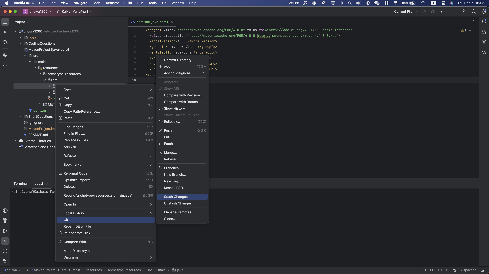
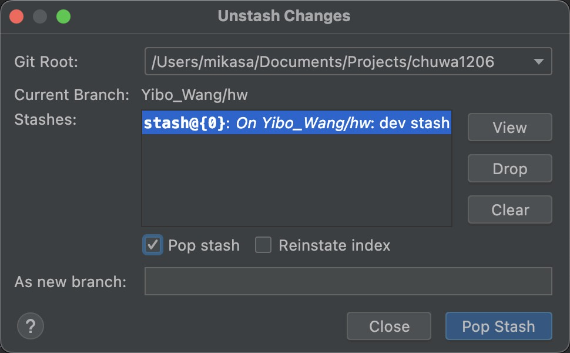

1. ##### Learn MarkDown and show all of basic usage in the ShortQuestions/README.md

   - [x] See current md file.

2. ##### practice git using the platform. list the git commands you learned

   ```
   git commit
   git checkout
   git branch
   git merge
   git rebase
   git cherry-pick
   git reset
   git revert
   git tag
   git clone
   git push
   git pull
   git fetch
   git fork
   ```

   

3. ##### What is the basic steps to init a git repo in you local ?

   ```
   git init
   git add .
   git commit -m "message"
   ```

4. ##### How to clone a repo from Github ?

   ```
   git clone url
   ```

5. ##### How to create a new branch and checkout to that branch ?

   ```
   git checkout -b mybranch
   ```

6. ##### How to merge the branch_test to master branch in command ? show me the commands

   ```
   git checkout master
   git merge branch_test
   ```

   

7. ##### How to stash your new code before leaving branch branch_learn_stash and pop your stash when you checkout back to branch_learn_stash ? try commands way and intellij way.

   ```
   git stash
   git stash list
   git stash pop
   ```

   


   



8. ##### How do you understand PR is based on Branch?

   Typically different branches are maintained by different people or serve different purpose. If everyone work on the same branch or can freely modify the main branch, it will be a disaster. This is when we need PR to control the modification and merging between branches.

9. ##### What is maven role ? what it be used to do ?

   Maven is a build automation tool for Java projects. It can be used to build project and manage dependencies. 

10. ##### What is the lifecycle of maven? could you tell me the details ?

    Maven lifecycle is based around the build lifecycle. It consists of multiple phases.

    - `validate` - validate the project is correct and all necessary information is available
    - `compile` - compile the source code of the project
    - `test` - test the compiled source code using a suitable unit testing framework. These tests should not require the code be packaged or deployed
    - `package` - take the compiled code and package it in its distributable format, such as a JAR.
    - `verify` - run any checks on results of integration tests to ensure quality criteria are met
    - `install` - install the package into the local repository, for use as a dependency in other projects locally
    - `deploy` - done in the build environment, copies the final package to the remote repository for sharing with other developers and projects.

11. ##### what is the difference between package and install in maven lifecycle ?

    - Package is to build the project and produce a compressed file of the project.
    - Install is to install the artifact 

    


12. ##### What is plugins in maven, list some plugins.

    Plugins are maven's components that get work done.

    - clean
    - compiler
    - jar
    - Antrun

13. ##### In Repo/MavenProject directory, create a maven Module using Intellij, named it as belows:

   - groupID: com.chuwa.learn

   - artifactID: java-core
