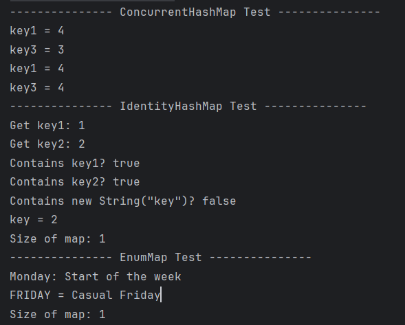
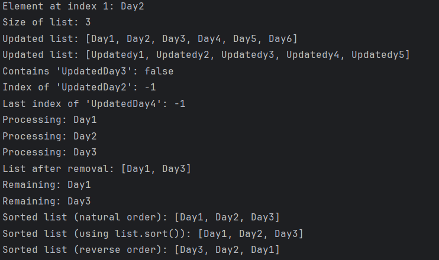
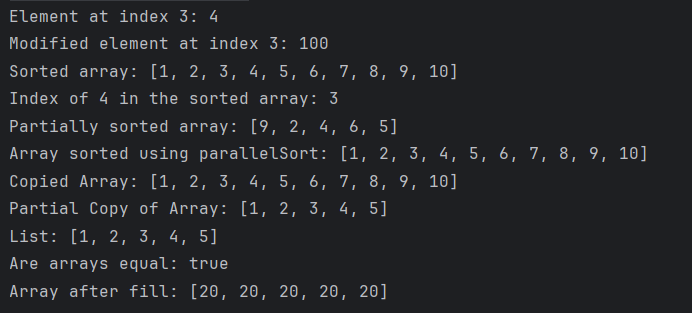
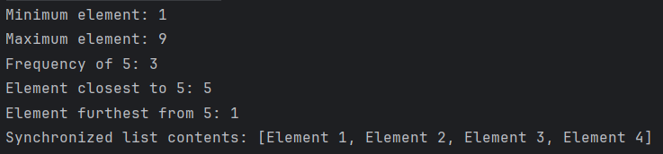
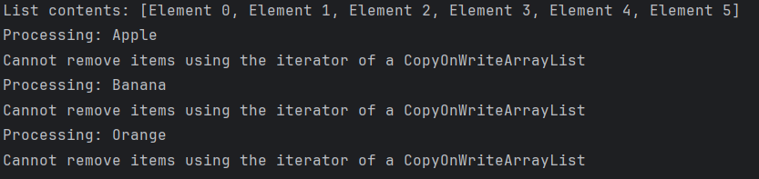
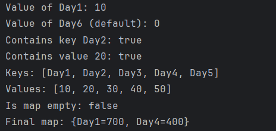
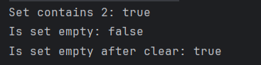
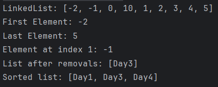
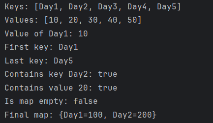
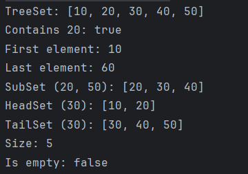

#### 1.  Practice Collections
- **AdditionalMapExerciseTest**: [Code](./CodeTest/AdditionalMapExerciseTest.java) 
- **ArrayListExerciseTest**: [Code](./CodeTest/ArrayListExerciseTest.java) 
- **ArraysExerciseTest**: [Code](./CodeTest/ArraysExerciseTest.java) 
- **CollectionsExerciseTest**: [Code](./CodeTest/CollectionsExerciseTest.java) 
- **CopyOnWriteArrayListExerciseTest**: [Code](./CodeTest/CopyOnWriteArrayListExerciseTest.java) 
- **HashMapExerciseTest**: [Code](./CodeTest/HashMapExerciseTest.java) 
- **HashSetExerciseTest**: [Code](./CodeTest/HashSetExerciseTest.java) 
- **LinkedHashMapExerciseTest**: [Code](./CodeTest/LinkedHashMapExerciseTest.java) 
- **LinkedListExerciseTest**: [Code](./CodeTest/LinkedListExerciseTest.java) 
- **TreeMapExerciseTest**: [Code](./CodeTest/TreeMapExerciseTest.java) 
- **TreeSetExerciseTest**: [Code](./CodeTest/TreeSetExerciseTest.java) 
#### 2.  What is the checked exception and unchecked exception in Java, could you give one example?
##### Checked Exceptions

Checked exceptions are exceptions that are checked at compile-time. This means that the compiler requires the code to either handle these exceptions with a try-catch block or declare them in the method signature using the `throws` keyword.
- **Example**: `FileNotFoundException`

    ```java
    import java.io.File;
    import java.io.FileNotFoundException;
    import java.util.Scanner;

    public class Example {
        public void readFile(String fileName) throws FileNotFoundException {
            File file = new File(fileName);
            Scanner scanner = new Scanner(file);
            // Read file...
        }
    }
    ```

##### Unchecked Exceptions

Unchecked exceptions are exceptions that are not checked at compile-time. In Java, these include `RuntimeException` and its subclasses. These exceptions are usually a result of bad programming.
- **Example**: `NullPointerException`

    ```java
    public class Example {
        public void process(String input) {
            if (input.length() > 0) {  // May throw NullPointerException if input is null
                // Process the input...
            }
        }
    }
    ```
#### 3.  Can there be multiple finally blocks?
In Java, multiple finally blocks associated with a single try block is not allowed. Each try block can be followed by either zero or one finally block.
- **Example**:

    ```java
    public class Example {
        public void process(String input) {
            try {
                    // Code that might throw an exception
            } finally {
                    // First finally block (invalid to have another)
            } finally {
                    // Second finally block - This is not allowed and will cause a compile-time error
            }
        }
    }

    ```
#### 4.  When both catch and finally return values, what will be the final result?
The value returned by the `finally` block will be the final result.This is because the `finally` block is always executed after the `try` and `catch` blocks, and if it contains a return statement, it ***overrides*** any return values from earlier `catch` blocks.
- **Example**:
    ```java
    public class Test {
        public static int method() {
            try {
                return 1; // This return value is overridden by the finally block
            } catch (Exception e) {
                return 2; // This return value is overridden by the finally block
            } finally {
                return 3; // This return value is the final result
            }
        }
        public static void main(String[] args) {
            int result = method();
            System.out.println(result); // Output will be 2
        }
    }
    ```
#### 5.  What is Runtime/unchecked exception? what is Compile/Checked Exception?
[Please refer to Question 2](#2-what-is-the-checked-exception-and-unchecked-exception-in-java-could-you-give-one-example)
#### 6.  What is the difference between throw and throws?
- **Functionality**: `throw` is used to actually throw an exception, while `throws` is used to declare that an exception might be thrown.
- **Location**: `throw` is used within a method or a code block, whereas `throws` is used with the method declaration.
- **Exception Handling**: Methods using `throw` can either handle the exception within a `try-catch` block or propagate it further up the call stack. On the other hand, methods declared with `throws` need the calling method to handle or further declare the exception.
- **Type of Exceptions**: `throw` can be used for both checked and unchecked exceptions, whereas `throws` is generally used for checked exceptions that need to be declared.
#### 7.  Run the below three pieces codes, Noticed the printed exceptions. why do we put the Null/Runtime exception before Exception ?

#### 8.  What is optional? why do you use it? write an optional example.
##### What is Optional?
`Optional` is a container object which may or may not contain a non-null value. It is a way to avoid `NullPointerException` and to explicitly deal with situations where a value may be absent.
##### Why Use Optional?
1. **Null Safety**: It helps to avoid `NullPointerException` that often occurs in Java code.
2. **Code Readability**: Makes the code more readable by explicitly handling the cases of absent values.
3. **API Clarity**: When used in method return types, it clearly communicates that the result may be absent.

- **Example**:
     ```java
     import java.util.Optional;
  
     public class OptionalExample {
         private static Optional<String> getOptionalValue() {
             String value = null;
             return Optional.ofNullable(value);
         }
  
         public static void main(String[] args) {
             Optional<String> optionalValue = getOptionalValue();
             optionalValue.ifPresent(value -> System.out.println("Value: " + value));
         }
         
     }
     ```
#### 9.  Why finally always be executed ?

In Java, the `finally` block is designed to always execute after the `try` block and any `catch` blocks. This is to ensure that essential code is executed regardless of whether an exception was thrown or caught.

#### 10.  What are the types of design patterns in Java ?
##### Creational Patterns
  1. **Singleton**: Ensures a class has only one instance and provides a global point of access to it.
  2. **Factory Method**: Defines an interface for creating an object, but lets subclasses alter the type of objects that will be created.
  3. **Abstract Factory**: Provides an interface for creating families of related or dependent objects without specifying their concrete classes.
  4. **Builder**: Separates the construction of a complex object from its representation, allowing the same construction process to create various representations.
  5. **Prototype**: Creates new objects by copying an existing object, known as the prototype.

##### Structural Patterns
  1. **Adapter**: Allows incompatible interfaces to work together. It involves a wrapper that converts one interface to another.
  2. **Composite**: Composes objects into tree structures to represent part-whole hierarchies.
  3. **Proxy**: Provides a placeholder for another object to control access to it.
  4. **Flyweight**: Reduces the cost of creating and manipulating a large number of similar objects.
  5. **Facade**: Provides a simplified interface to a complex subsystem.
  6. **Bridge**: Separates an object’s abstraction from its implementation, so the two can vary independently.
  7. **Decorator**: Adds new functionality to an object without altering its structure.

##### Behavioral Patterns
  1. **Observer**: Defines a dependency between objects so that when one object changes state, all its dependents are notified and updated automatically.
  2. **Strategy**: Enables selecting an algorithm at runtime. Instead of implementing a single algorithm directly, code receives run-time instructions as to which in a family of algorithms to use.
  3. **Command**: Turns a request into a stand-alone object that contains all information about the request.
  4. **State**: Allows an object to alter its behavior when its internal state changes.
  5. **Chain of Responsibility**: Passes a request along a chain of handlers. Upon receiving a request, each handler decides either to process the request or to pass it to the next handler in the chain.
  6. **Memento**: Provides the ability to restore an object to its previous state.
  7. **Template Method**: Defines the skeleton of an algorithm in the superclass but lets subclasses override specific steps of the algorithm without changing its structure.
#### 11.  What are the SOLID Principles ?
- **Single Responsibility Principle (SRP)**: A class should have one, and only one, reason to change. This principle aims to separate behaviors so that if bugs arise as a result of your change, they are in the class you changed.
- **Open/Closed Principle (OCP)**: Software entities should be open for extension but closed for modification. This means that a class should be extendable without modifying the class itself.
- **Liskov Substitution Principle (LSP)**: Objects in a program should be replaceable with instances of their subtypes without altering the correctness of the program. This principle is mostly about the correct inheritance, ensuring that derived classes extend base classes in ways that do not break base class functionality.
- **Interface Segregation Principle (ISP)**: Clients should not be forced to depend upon interfaces they do not use. This principle aims to reduce the side effects and frequency of required changes by splitting the software into multiple, independent parts.
- **Dependency Inversion Principle (DIP)**: High-level modules should not depend on low-level modules. Both should depend on abstractions. Abstractions should not depend on details. Details should depend on abstractions. This principle leads to the decoupling of software modules. This way, instead of high-level modules depending on low-level modules, both will depend on abstractions.

#### 12.  How can you achieve thread-safe singleton patterns in Java ?
- **Eager Initialization**: Create the Singleton instance at the time of class loading.
    ```java
    public class Singleton {
        private static final Singleton INSTANCE = new Singleton();

        private Singleton() {}

        public static Singleton getInstance() {
            return INSTANCE;
        }
    }
    ```

- **Synchronized Accessor**: Use a synchronized method to control access to the Singleton instance. Drawback: High performance cost due to synchronization overhead.

    ```java
    public class Singleton {
        private static Singleton instance;

        private Singleton() {}

        public static synchronized Singleton getInstance() {
            if (instance == null) {
                instance = new Singleton();
            }
            return instance;
        }
    }
    ```

- **Double-Checked Locking (DCL)**: Double-check the instance before and after synchronizing the block.

    ```java
    public class Singleton {
        private static volatile Singleton instance;

        private Singleton() {}

        public static Singleton getInstance() {
            if (instance == null) {
                synchronized (Singleton.class) {
                    if (instance == null) {
                        instance = new Singleton();
                    }
                }
            }
            return instance;
        }
    }
    ```

- **Static Inner Class**: Utilize a static inner class for the Singleton initialization.

    ```java
    public class Singleton {
        private Singleton() {}

        private static class SingletonHolder {
            private static final Singleton INSTANCE = new Singleton();
        }

        public static Singleton getInstance() {
            return SingletonHolder.INSTANCE;
        }
    }
    ```
#### 13.  What do you understand by the Open-Closed Principle (OCP) ?
[Please refer to Question 11](#11-what-are-the-solid-principles-)

#### 14.  Liskov’s substitution principle states that if class B is a subtype of class A, then object of type A may be substituted with any object of type B. What does this actually mean?
It means that if the object of type A can do something, the object of type B could also be able to perform the same thing.

#### 15.  Watch the design pattern video, and type the code, submit it to MavenProject folder
[Singleton](../Repo/MavenProject/java-core/src/main/java/pattern/singleton)
[Factory](../Repo/MavenProject/java-core/src/main/java/pattern/factory)
[Builder](../Repo/MavenProject/java-core/src/main/java/pattern/builder)
[Observer](../Repo/MavenProject/java-core/src/main/java/pattern/observer)

