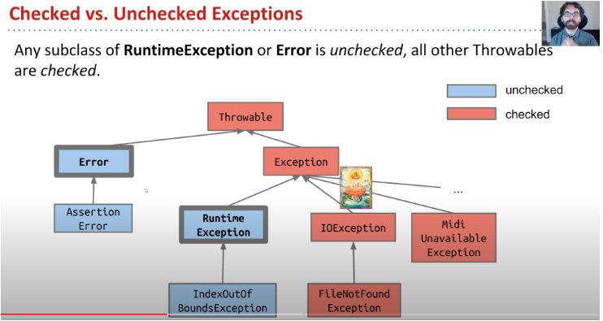
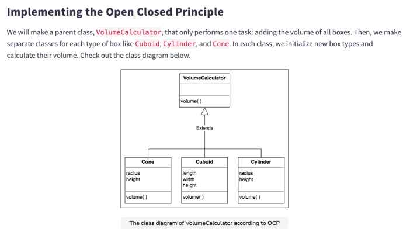

1. Practice collection

    in chuwa1206/CodingQuestion/CollectionsPractise
2. What is the checked exception and unchecked exception in Java, could you give one example?
- **Checked exceptions**: checked at compile-time. e.g. FileNotFundException
- **Unchecked exceptions**: checked at run-time. e.g. ArithmeticException

3. Can there be multiple finally blocks?

    A try or try-catch block can only has one finally blocks
4. When both catch and finally return values, what will be the final result?
    
    will return the value in finally.
    example:
    ```java
    class HelloWorld {
        public static int test() {
            int a = 0;
            try {
                a = 1;
                return a;
            } catch(Exception e){
                a = 2;
                return a;
            }finally {
                a = 3;
                return a;
            }
        }
        public static void main(String[] args) {
            System.out.println(test());
        }
    }
    ```
    > output: a = 3;
5. What is Runtime/unchecked exception? what is Compile/Checked Exception?

   - Runtime/unchecked exception:
     >Represent errors outside the control of the program, such as I/O errors, network errors, and database errors
   - Compile/Checked Exception:
     >Represent errors within the program logic, such as null pointer exceptions, arithmetic exceptions, and array index out of bounds exceptions123. A common example of an unchecked exception is ArithmeticException, which is thrown when a program tries to divide a number by zero.

6. What is the difference between throw and throws?

    Throw and Throws are two different keywords used in exception handling.
    - Throw
      > Used to explicitly throw an exception from a method or block of code. It is followed by an instance of an exception class that is thrown explicitly from the code.
    - Throws
      >Used in the method signature to declare the exceptions that a method might throw. It is followed by the class names of the exceptions that the method might throw.

7. Run the below three pieces codes, Noticed the printed exceptions. why do we put the Null/Runtime
   exception before Exception ? 

    - The program is executed sequentially. First catch should be the smallest scope, otherwise the other exceptions in the catch can never cauch Exceptions because the first catch will always catch all Exceptions. 
    - Same level of Exceptions will be caught based on the Exception appear time.

8. What is optional? why do you use it? write an optional example.
   - Optional is a class introduced in Java 8 that provides a type-level solution for representing optional values instead of null references 1. It is used to avoid null pointer exceptions and to make the code more readable and maintainable.
   - An Optional object can either contain a non-null value (in which case it is considered present) or it can contain no value at all
   - Personally feel like Optional is a type that allow null value and without throw a Exception. 

9. Why finally always be executed ?

    finally will be called after the execution of the try or catch code blocks. 

     The only times finally won't be called are:
    - If you invoke System.exit()
      - If you invoke Runtime.getRuntime().halt(exitStatus)
      - If the JVM crashes first
      - If the JVM reaches an infinite loop (or some other non-interruptable, non-terminating statement) in the try or catch block
      - If the OS forcibly terminates the JVM process; e.g., kill -9 <pid> on UNIX
      - If the host system dies; e.g., power failure, hardware error, OS panic, et cetera
      - If the finally block is going to be executed by a daemon thread and all other non-daemon threads exit before finally is called

10. What are the types of design patterns in Java ?
    - Creational patterns are concerned with object creation mechanisms, trying to create objects in a manner suitable to the situation. Examples of creational patterns include Singleton, Factory Method, Abstract Factory, Builder, and Prototype patterns.

    - Structural patterns are concerned with object composition, trying to form large object structures from individual objects. Examples of structural patterns include Adapter, Bridge, Composite, Decorator, Facade, Flyweight, and Proxy patterns.

    - Behavioral patterns are concerned with object interaction, trying to define the ways objects interact and communicate with each other. Examples of behavioral patterns include Chain of Responsibility, Command, Interpreter, Iterator, Mediator, Memento, Observer, State, Strategy, Template Method, and Visitor patterns.


11. What are the SOLID Principles?
    - Single Responsibility Principle (SRP): A class should have only one reason to change.
    - Open-Closed Principle (OCP): A class should be open for extension but closed for modification.
    - Liskov Substitution Principle (LSP): Subtypes must be substitutable for their base types.
    - Interface Segregation Principle (ISP): A client should not be forced to depend on methods it does not use.
    - Dependency Inversion Principle (DIP): High-level modules should not depend on low-level modules. Both should depend on abstractions.

12. How can you achieve thread-safe singleton patterns in Java ?
    - Eager initialization: In this approach, the instance of the singleton class is created at the time of class loading. This approach is thread-safe without any synchronization overhead. However, it has the disadvantage of creating the instance even if it is not used in the application.

    - Synchronized getInstance() method: In this approach, the getInstance() method is synchronized. This ensures that only one thread can access the method at a time. However, this approach has the disadvantage of slowing down the performance due to the locking overhead.

    - Double-checked locking: In this approach, the getInstance() method is synchronized only for the first few threads when the instance variable is null. Once the instance variable is initialized, the synchronization overhead is avoided. This approach is thread-safe and provides lazy initialization.

13. What do you understand by the Open-Closed Principle (OCP) ?

    This means that a system should improve easily by adding new code instead of changing the code core.
    
14. Liskov’s substitution principle states that if class B is a subtype of class A, then object of type A may be
    substituted with any object of type B. What does this actually mean? (from OA ) choose your answer.
    
    1. It means that if the object of type A can do something, the object of type B could also be able to
       perform the same thing
    2. It means that all the objects of type A could execute all the methods present in its subtype B
    3. It means if a method is present in class A, it should also be present in class B so that the object of
       type B could substitute object of type A.
    4. It means that for the class B to inherit class A, objects of type B and objects of type A must be same.
    > choose third one, because it focuses on ensuring that the substitution of objects does not break the expected behavior of the program

16. design pattern in MavenProject folder
