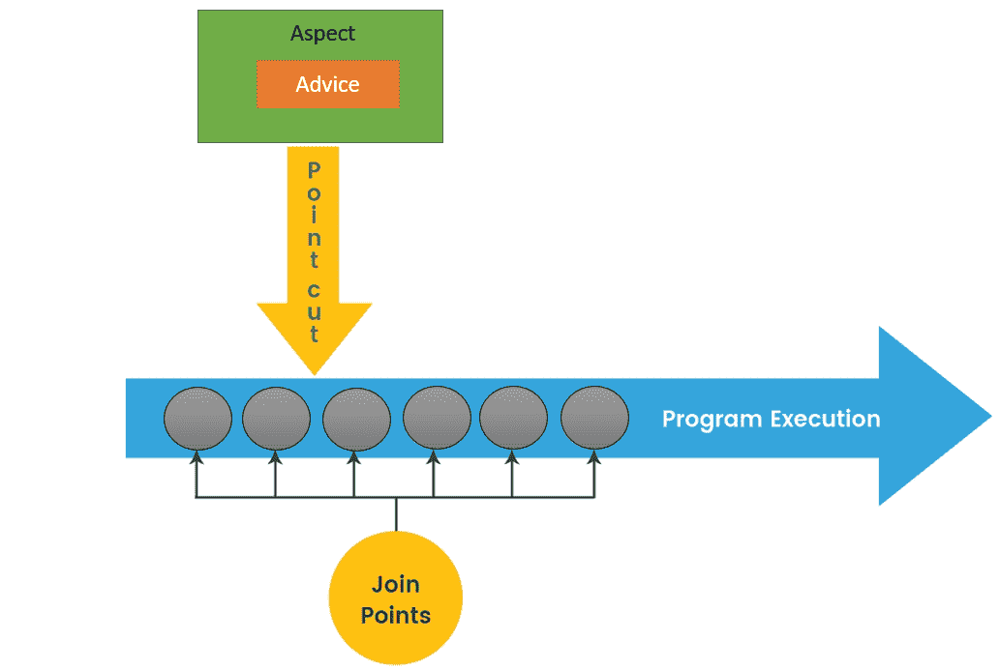
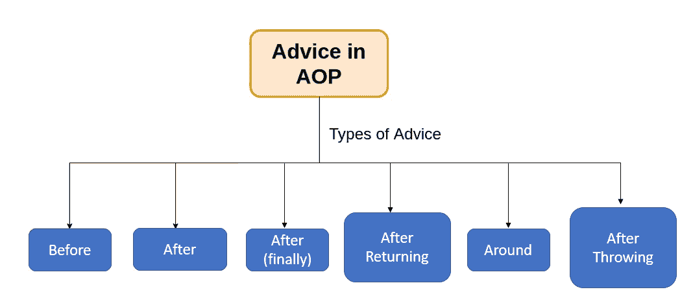
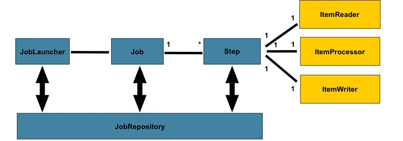

1. annotation.md has been created.
2. Briefly reading: https://www.techgeeknext.com/spring-boot/spring-aop-interview-questions
3. What is the Aspect Oriented Programming?
   Aspect-oriented programming (AOP) is a programming technique that supports the separation of **cross-cutting concerns** in order to increase modularity. AOP is typically used to implement **cross-cutting concerns**, which implies that it defines functionality that is required in multiple places across an application in one place. You can add new functionality before or after a method is executed like transaction management, logging or security which cut across multiple types and objects (often termed crosscutting concerns).
4. What are the advantages and disadvantages of Spring AOP?

   - Advantages of Spring AOP:

     1. It is easy to configure.
     2. Spring AOP is implemented in pure Java, so separate compilation unit or separate class loader are not required.
     3. It utilizes Spring's IOC container for dependency injection.
     4. Can create aspects using @AspectJ annotation based or using XML based.
     5. It integrates cross-cutting concerns into the classes.

   - Disadvantages of Spring AOP:
     1. Debugging the AOP framework-based application code is a little challenge.
     2. Only methods with a public visibility will be recommended, not those with a private, protected, or default visibility.
     3. Aspects cannot be advised by other aspects. This is because once a class is marked as an aspect (using XML or annotation), Spring prevents it from being auto-proxied.

5. What is Aspect in Spring AOP?

   An aspect is a **cross-cutting module** that combines **advice** and **pointcuts**. A standard class tagged with the `@Aspect` annotation can be used to implement an aspect. Aspects are mostly used to enable cross-cutting concerns like logging, profiling, caching, and transaction management.

   

6. What is Pointcut in Spring AOP?

   A pointcut is an expression that chooses one or more join points at which advice is given. Pointcuts can be defined using expressions or patterns. It supports a number of expressions that correspond to the join points.

7. What is the Join point in Spring AOP?

   A join point is a place in the application where an AOP aspect is applied. It could also be a specific advice execution instance. A join point in AOP can be a method execution, exception handling, changing the value of an object variable, and so on.

8. What does it mean by Advice and its types in Spring AOP?

   The advice is an **action** which we take **before** or **after** the method execution. In the Spring AOP framework, there are five types of advice: **before**, **after**, **after-returning**, **after-throwing**, and **around advice**. Advice is taken at a specific join point.

   

9. Reading: https://www.javainuse.com/spring/sprbatch_interview
10. When to use Spring Batch?

    Consider an environment where users have to do a lot of batch processing. This will be quite different from a typical web application which has to work **24/7**. But in classic environments it's not unusual to do the heavy lifting for example during the **night** when there are no regular users using your system. Batch processing includes typical tasks like reading and writing to files, transforming data, reading from or writing to databases, create reports, import and export data and things like that. Often these steps have to be chained together or you have to create more complex workflows where you have to define which job steps can be run in parallel or have to be run sequentially etc. That's where a framework like Spring Batch can be very handy. Spring Boot Batch provides reusable functions that are essential in processing **large volumes** of records, including logging/tracing, transaction management, job processing statistics, job restart, skip, and resource management. It also provides more advanced technical services and features that will enable extremely **high-volume and high performance** batch jobs though optimization and partitioning techniques. Simple as well as complex, high-volume batch jobs can leverage the framework in a **highly scalable** manner to process significant volumes of information.

11. How Spring Batch works?

    

    - Step: A Step that delegates to a Job to do its work. This is a great tool for managing dependencies between jobs, and also to modularise complex step logic into something that is testable in isolation. The job is executed with parameters that can be extracted from the step execution, hence this step can also be usefully used as the worker in a parallel or partitioned execution.
    - ItemReader: Strategy interface for providing the data. Implementations are expected to be stateful and will be called multiple times for each batch, with each call to read() returning a different value and finally returning null when all input data is exhausted. Implementations need not be thread-safe and clients of a ItemReader need to be aware that this is the case. A richer interface (e.g. with a look ahead or peek) is not feasible because we need to support transactions in an asynchronous batch.
    - ItemProcessor: Interface for item transformation. Given an item as input, this interface provides an extension point which allows for the application of business logic in an item oriented processing scenario. It should be noted that while it's possible to return a different type than the one provided, it's not strictly necessary. Furthermore, returning null indicates that the item should not be continued to be processed.
    - ItemStreamWriter: Basic interface for generic output operations. Class implementing this interface will be responsible for serializing objects as necessary. Generally, it is responsibility of implementing class to decide which technology to use for mapping and how it should be configured. The write method is responsible for making sure that any internal buffers are flushed. If a transaction is active it will also usually be necessary to discard the output on a subsequent rollback. The resource to which the writer is sending data should normally be able to handle this itself.

12. How can we schedule a Spring Batch Job?

    You can schedule a Spring Batch job using the @Scheduled annotation:

    1. Define Your Batch Job: Define your Spring Batch job as you normally would, with steps, readers, writers, processors, and any other necessary components.
    2. Create a Job Launcher: Create a bean of JobLauncher type in your Spring configuration. The JobLauncher is responsible for launching Spring Batch jobs.
    3. Schedule the Job: Use the @Scheduled annotation to specify when you want to run the job. This annotation can be applied to a method that triggers the job execution.

    ```
    @Component
    public class JobScheduler {

        @Autowired
        private Job job; // Autowire the Spring Batch job

        @Autowired
        private JobLauncher jobLauncher; // Autowire the JobLauncher

        // Schedule the job to run every 5 minutes
        @Scheduled(fixedRate = 300000) // 300000 milliseconds = 5 minutes
        public void scheduleJob() throws Exception {
            JobExecution jobExecution = jobLauncher.run(job, new JobParameters());
            System.out.println("Job Execution Status: " + jobExecution.getStatus());
        }
    }
    ```

13. What is the cron expression?

    Cron expressions are used to configure instances of CronTrigger, a subclass of org.quartz.Trigger. A cron expression is a string consisting of six or seven subexpressions (fields) that describe individual details of the schedule. These fields, separated by white space, can contain any of the allowed values with various combinations of the allowed characters for that field. Table A-1 shows the fields in the expected order.

    Table A-1: https://docs.oracle.com/cd/E12058_01/doc/doc.1014/e12030/cron_expressions.htm

14. What is the spring task?

    The spring task allows you to schedule and execute tasks at specific intervals or times within a Spring application context. It provides a convenient abstraction for scheduling repetitive or time-based tasks, similar to the functionality provided by Java's `ScheduledExecutorService` and other task scheduling libraries. Spring Task provides a flexible and easy-to-use API for task scheduling, allowing you to configure tasks using annotations or XML-based configuration. It integrates seamlessly with the Spring application context and supports various task scheduling strategies, including fixed-rate, fixed-delay, and cron expressions.

15. When to use Spring task?

    - Periodic Data Maintenance
    - Automated Email Notifications
    - Batch Processing
    - Cache Refresh
    - Health Checks and Monitoring
    - Background Processing

16. What is Filter and any filter example?

    The Filter allows developers to intercept and modify requests and responses before they are sent to the servlet or after they are returned by the servlet. Filters are used to perform common pre-processing and post-processing tasks in web applications, such as logging, authentication, authorization, data compression, encryption, and more.

    Here's a simple example of a filter that logs information about incoming requests:

    ```
    @WebFilter("/*")
    public class LoggingFilter implements Filter {

        @Override
        public void init(FilterConfig filterConfig) throws ServletException {
            // Initialization code, if needed
        }

        @Override
        public void doFilter(ServletRequest request, ServletResponse response, FilterChain chain) throws IOException, ServletException {
            // Log information about the incoming request
            String requestUrl = ((HttpServletRequest) request).getRequestURL().toString();
            System.out.println("Request received for URL: " + requestUrl);

            // Pass the request and response objects to the next filter in the chain
            chain.doFilter(request, response);
        }

        @Override
        public void destroy() {
            // Cleanup code, if needed
        }
    }
    ```

17. What is the Interceptor? What we can do with interceptor?

    The interceptor is an object that allows you to intercept and manipulate HTTP requests and responses before and after they are handled by a controller. Interceptors provide a way to implement cross-cutting concerns and apply pre-processing and post-processing logic to HTTP requests and responses.

    Here's an overview of what you can do with interceptors:

    - Pre-processing of Requests
    - Post-processing of Responses
    - Implementing Cross-cutting Concern
    - Implementing Aspect-Oriented Programming (AOP)
    - Fine-grained Control over Request Handling

18. In Interceptor, What is preHandle? What is postHandle?

    The preHandle method is called before the actual handler (controller method) is invoked. It allows you to perform pre-processing tasks and optionally decide whether the request should proceed to the handler or be intercepted.

    The postHandle method is called after the actual handler has been invoked but before the view is rendered. It allows you to perform post-processing tasks, such as modifying the model and view before rendering.

19. What is Swagger?

    Swagger is an open-source framework that simplifies the process of designing, documenting, and consuming RESTful APIs. It allows developers to describe the structure and behavior of their APIs using a standardized format, typically written in YAML or JSON. Swagger generates interactive API documentation, making it easier for developers to understand and test API endpoints without relying on external documentation or manual testing. Additionally, Swagger provides tools for automatically generating client SDKs, server stubs, and API documentation, streamlining the process of building and integrating APIs across different platforms and programming languages.
