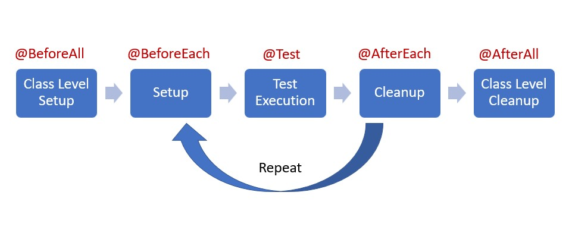

1.  annotation.md has been created.
2.  What is selenium?

    Selenium is a popular open-source automated testing tool primarily used for web applications. It provides a set of tools and libraries that allow developers to automate interactions with web browsers.

    example code:

    ```
    public class SeleniumExample {

        public static void main(String[] args) {
            // Set the path to the Chrome driver executable
            System.setProperty("webdriver.chrome.driver", "/path/to/chromedriver");

            // Create a new instance of the ChromeDriver
            WebDriver driver = new ChromeDriver();

            // Navigate to the application URL
            driver.get("https://www.example.com");

            // Find the search input field by its name attribute
            WebElement searchInput = driver.findElement(By.name("q"));

            // Enter a search query into the search input field
            searchInput.sendKeys("Selenium automated testing");

            // Find the search button by its CSS selector
            WebElement searchButton = driver.findElement(By.cssSelector("input[type='submit']"));

            // Click the search button to submit the search query
            searchButton.click();

            // Wait for a few seconds to observe the search results
            try {
                Thread.sleep(5000); // Sleep for 5 seconds
            } catch (InterruptedException e) {
                e.printStackTrace();
            }

            // Close the browser window and terminate the WebDriver instance
            driver.quit();
        }
    }
    ```

3.  What is cucumber?

    Cucumber is a popular open-source tool for behavior-driven development (BDD). It allows software teams to write executable specifications in plain text format, which are then translated into automated tests. Cucumber promotes collaboration between stakeholders, testers, and developers by enabling them to write and understand tests in a common language.

    Example of Cucumber feature file:

    ```
     Feature: Login Functionality
     As a user
     I want to log in to the application
     So that I can access my account

     Scenario: Valid login credentials
         Given I am on the login page
         When I enter username "user123" and password "password123"
         And I click the login button
         Then I should be redirected to the dashboard page

     Scenario: Invalid login credentials
         Given I am on the login page
         When I enter username "invaliduser" and password "invalidpassword"
         And I click the login button
         Then I should see an error message "Invalid username or password"
    ```

    Cucumber in Java:

    ```
     public class LoginSteps {

         @Given("I am on the login page")
         public void iAmOnLoginPage() {
             // Code to navigate to the login page
         }

         @When("I enter username {string} and password {string}")
         public void enterUsernameAndPassword(String username, String password) {
             // Code to enter username and password into login form
         }

         @When("I click the login button")
         public void clickLoginButton() {
             // Code to click the login button
         }

         @Then("I should be redirected to the dashboard page")
         public void redirectToDashboardPage() {
             // Code to verify redirection to the dashboard page
         }

         @Then("I should see an error message {string}")
         public void verifyErrorMessage(String errorMessage) {
             // Code to verify the error message displayed on the login page
         }
     }
    ```

4.  What is JMeter?

    Apache JMeter is an open-source Java-based tool designed for load testing and performance measurement of web applications. It can be used to simulate heavy loads on servers, networks, or objects to test their strength, performance, and reliability under various conditions.

5.  What is the lifecircle of Junit?

    The complete lifecycle of a test case can be seen in three phases with the help of annotations.

    1. Setup: This phase puts the the test infrastructure in place. JUnit provides class level setup (@BeforeAll) and method level setup (@BeforeEach). Generally, heavy objects like databse comnections are created in class level setup while lightweight objects like test objects are reset in the method level setup.
    2. Test Execution: In this phase, the test execution and assertion happen. The execution result will signify a success or failure.
    3. Cleanup: This phase is used to cleanup the test infrastructure setup in the first phase. Just like setup, teardown also happen at class level (@AfterAll) and method level (@AfterEach).

    

6.  Is @BeforeAll method should be Class level(static)?

    Yes, it must be declared static since this method should be called only once in the entire tests execution cycle. Also, @BeforeEach, @AfterAll and @AfterEach should be declared as static.

7.  What is Mockito? And what is its limitations? what kind of tools can give help?

    Mockito is an open-source Java framework used for creating and configuring mock objects in unit tests. Mock objects are simulated objects that mimic the behavior of real objects in controlled ways. Mockito helps in isolating the code under test by mocking dependencies and defining their behavior, allowing developers to focus on testing specific units of code in isolation.

    Limitations:

    - Limited Support for Final and Static Methods
    - Verbose Syntax for Some Operations
    - Limited Support for Private Methods

    Tools:

    - PowerMockito: PowerMock is an extension to Mockito (and other mocking frameworks) that provides additional capabilities, including the ability to mock final classes, static methods, and private methods.
    - Mockito Extension Libraries (such as Mockito-Kotlin and Mockito-Java8)

8.  What is @Mock and what is @InjectMocks?

    @Mock is an annotation used to create a mock object of a class or interface.

    @InjectMocks is an annotation used to inject mocked dependencies into the target class under test.

9.  What is the stubbing (define behaviors)?

    In software testing, stubbing refers to the process of defining the behavior of dependent objects (or collaborators) within a test environment. It is a technique used in unit testing and is particularly common in the context of mocking frameworks like Mockito.

    Stubbing involves setting up expectations and defining specific behaviors for method calls on the stubbed objects. This allows you to control how the dependent objects will behave during the test scenario.

10. What is Mockito ArgumentMatchers?

    Mockito ArgumentMatchers are utility methods provided by the Mockito framework to define flexible argument matching conditions when setting up stubbing or verifying interactions in mock objects. ArgumentMatchers enable you to specify **matching criteria** for method parameters in Mockito stubbing and verification scenarios. They allow you to **define expectations** for method invocations with varying argument values, types, or conditions.

11. What is Hamcrest Matchers?

    Hamcrest Matchers is a framework for writing flexible and readable assertions in Java unit tests. It provides a collection of matchers that can be used with testing frameworks like JUnit, TestNG, and Mockito to define conditions for expected outcomes or behavior.

    Hamcrest Matchers allows developers to express assertions in a more natural and fluent manner compared to traditional Java assertion methods. It provides a wide range of matchers for different types of objects, collections, and conditions, making it easier to write expressive and maintainable tests.

12. Do you know @spy? what is difference between @spy and @Mock?

    @Spy is an annotation used to create a spy object, which is a partial mock of a real object.

    Difference between @Spy and @Mock:

    - With @Mock, you're creating a completely mocked instance of the class or interface. You define all behaviors using Mockito stubbing methods, and there's no real behavior involved.
    - With @Spy, you're creating a partially mocked instance of the real class. Real methods are invoked unless they are explicitly stubbed. You can use @Spy when you want to test the real behavior of the object but still have control over certain methods.

13. What is assertion?

    In Java, assertions are a mechanism used to test assumptions in your code during development and debugging. They are typically used to verify conditions that must be true at certain points in your program's execution. Assertions help to catch logical errors and unexpected conditions early in the development process.

    Assertions are written using the assert keyword followed by a boolean expression. If the boolean expression evaluates to true, the assertion passes silently. However, if the boolean expression evaluates to false, an AssertionError is thrown, indicating that the assumption or condition being tested has failed.

    ```
    Assertions.assertEquals(expect_value, actual_value, optional_message)
    ```

14. If you have developed a new feature, how many types of tests for this feature? And what kind of tests are written by you? what is the purpose of each type of tests?

    | TYPE OF TESTING               | DEFINITION                                                                                                                                 | PURPOSE                                                                          |
    | ----------------------------- | ------------------------------------------------------------------------------------------------------------------------------------------ | -------------------------------------------------------------------------------- |
    | Unit Testing                  | Testing the smallest testable units of a program, such as functions or methods                                                             | Verify the correctness of **individual components**                              |
    | Integration Testing           | Testing the interactions between multiple components or modules                                                                            | Verify that the collaboration between components or modules is correct           |
    | Regression Testing            | After modifying the program orenvironment, re-run previously run tests to confirm that no new errors have been introduced                  | Ensure that after changes, **existing functionality** is still correct           |
    | Performance Testing           | Testing the performance and **response time** of a system under a specific workload                                                        | Verify the performance and **efficiency** of the system -> 200ms                 |
    | Stress Testing                | Testing the **stability** and **reliability** of a system by simulating an environment with workloads or data volumes beyond normal levels | Ensure that the system can still work normally under **high pressure** -> 2k QPS |
    | User Acceptance Testing (UAT) | The end user tests the software to confirm that it can perform the required tasks under actual conditions                                  | Ensure that the software meets user **needs** and **expectations**               |
