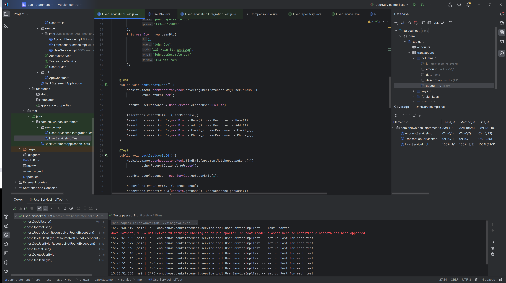
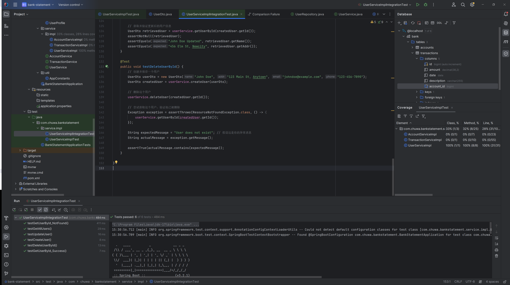

2. **What is Selenium?**  
   Selenium is a portable framework for testing web applications. It provides tools for writing functional tests without the need for learning a test scripting language. It supports various browsers and programming languages, enabling automated browser control for robust web application testing.

3. **What is Cucumber?**  
   Cucumber is a tool based on Behavior Driven Development (BDD) framework which is used to write acceptance tests for web applications. It allows automation of functional validation in easily readable and understandable format (like plain English) for Business Analysts, Developers, Testers, etc.

4. **What is JMeter?**  
   JMeter is an open-source load testing tool for analyzing and measuring the performance of a variety of services, with a focus on web applications. JMeter simulates a group of users sending requests to a target server and returns statistical information about the performance under load.

5. **What is the lifecycle of JUnit?**  
   The lifecycle of JUnit includes annotated methods that run at specified points in a test’s lifecycle:
    - `@BeforeAll` – executed once before all test methods in the current class.
    - `@BeforeEach` – executed before each test method.
    - `@Test` – specifies a method as a test method.
    - `@AfterEach` – executed after each test method.
    - `@AfterAll` – executed once after all test methods in the current class.

6. **Is @BeforeAll method should be Class level (static)?**  
   @BeforeAll methods must be static because they are executed before the test class is instantiated by JUnit. It's used for initializing shared resources.

7. **What is Mockito? And what are its limitations? What kind of tools can give help?**  
   Mockito is a popular mocking framework for unit tests in Java. Limitations of Mockito include:
    - Cannot mock static methods, constructors, and private methods directly.
    - Cannot mock final classes or methods.
      Other tools like PowerMock can help overcome some of Mockito's limitations by allowing mocking of static methods, private methods, and more.

8. **What is @Mock and what is @InjectMocks?**  
   @Mock is used to create a mock object for the purpose of replacing the real object with a simulated one that mimics the behavior of the real object. @InjectMocks is used to create an instance of the class and injects the mocks that are created with the @Mock (or @Spy) annotations into this instance.

9. **What is stubbing (define behaviors)?**  
   Stubbing refers to the practice of replacing a method's real functionality with custom behavior (or a 'stub') when using a mock object in unit testing. This is used to control the output of methods to test specific scenarios.

10. **What is Mockito ArgumentMatchers?**  
    Mockito ArgumentMatchers are used to provide flexible argument matching in stubbing or verification. They allow for more generic stubs or verifications instead of hard-coded values.

11. **What is Hamcrest Matchers?**  
    Hamcrest Matchers are a framework for writing matcher objects, allowing 'match' rules to be defined declaratively. They can be used with JUnit assertions and Mockito verifications for more readable tests.

12. **Do you know @spy? What is the difference between @spy and @Mock?**  
    @Spy allows you to create a spy on real objects. The difference between @Spy and @Mock is that with @Spy, the real methods are called (unless a method was stubbed), whereas with @Mock, the method calls are not passed to the real object but are intercepted by the mock.

13. **What is assertion?**  
    Assertion is a statement in test code that verifies that the state of the application under test meets the expectations of the test. It's a key component in testing, as it is used to ensure that the test passes or fails based on the actual outcome versus the expected outcome.  

14. **If you have developed a new feature, how many types of tests for this feature? And what kind of tests are written by you? What is the purpose of each type of tests?**
    For a new feature, multiple types of tests could be developed, including:
- **Unit Tests**: Written by developers, focus on individual units of code.
- **Integration Tests**: Also written by developers or QA engineers, test the integration points between components.
- **Functional Tests**: Often written by QA engineers, test the features for the end-users.
- **Performance Tests**: Measure the performance and scalability of the feature under different conditions.
- **Acceptance Tests**: Verify the feature against the requirements, often automated with tools like Cucumber.  
The purpose of each type of test varies, from ensuring code correctness in Unit Tests to validating user experience in Acceptance Tests.

