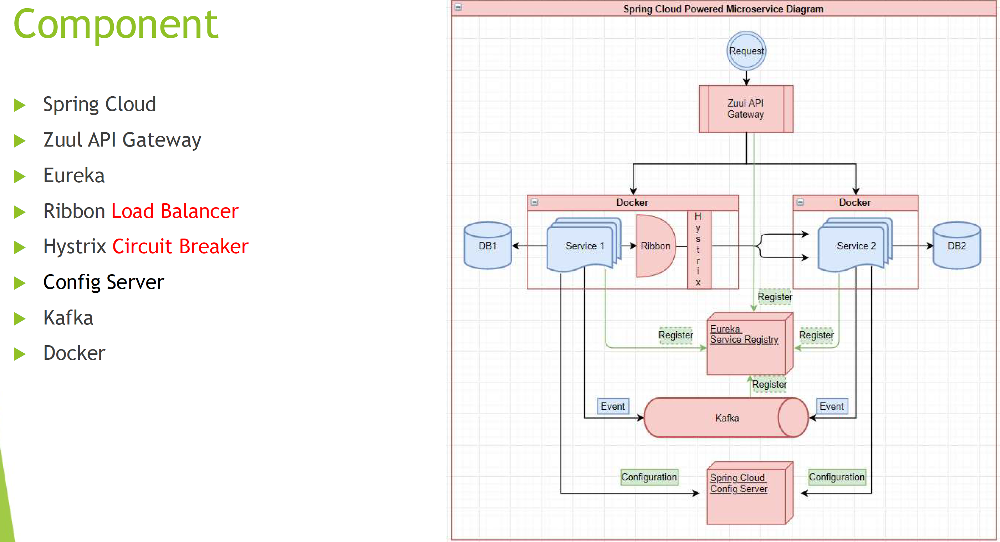

### 2. Document the microservice architeture and components/tools/dependencies

### 3. What are Resilience patterns? What is circuit breaker?

> Resilience patterns
>
> Time out:
>
> A timeout prevents a microservice from waiting too long for another microservice.
>
> Circuit breaker:
>
> If a system call results in an error, the circuit breaker is opened and does not allow any calls to pass through.

### 4. Read this article, then list the important questions, then write your answers

> ### 1. Write main features of Microservices.
>
> - **Decoupling**: Within a system, services are largely decoupled. The application as a whole can therefore be easily constructed, altered, and scalable
> - **Componentization**: Microservices are viewed as independent components that can easily be exchanged or upgraded
> - **Business Capabilities**: Microservices are relatively simple and only focus on one service
> - **Team autonomy**: Each developer works independently of each other, allowing for a faster project timeline
> - **Continuous Delivery**: Enables frequent software releases through systematic automation of software development, testing, and approval
> - **Responsibility:** Microservices are not focused on applications as projects. Rather, they see applications as products they are responsible for
> - **Decentralized Governance:** Choosing the right tool according to the job is the goal. Developers can choose the best tools to solve their problems
> - **Agility:** Microservices facilitate agile development. It is possible to create new features quickly and discard them again at any time.
>
> ### 2. Write main components of Microservices.
>
> Some of the main components of microservices include: 
>
> - Containers, Clustering, and Orchestration 
> - IaC [Infrastructure as Code Conception] 
> - Cloud Infrastructure 
> - API Gateway 
> - Enterprise Service Bus 
> - Service Delivery 
>
> ### 3. What are the benefits and drawbacks of Microservices?
>
> **Benefits:** 
>
> - Self-contained, and independent deployment module. 
> - Independently managed services.  
> - In order to improve performance, the demand service can be deployed on multiple servers.  
> - It is easier to test and has fewer dependencies.  
> - A greater degree of scalability and agility.  
> - Simplicity in debugging & maintenance.  
> - Better communication between developers and business users.  
> - Development teams of a smaller size.
>
> **Drawbacks:** 
>
> - Due to the complexity of the architecture, testing and monitoring are more difficult.  
> - Lacks the proper corporate culture for it to work.  
> - Pre-planning is essential.  
> - Complex development.  
> - Requires a cultural shift.  
> - Expensive compared to monoliths.  
> - Security implications. 
> - Maintaining the network is more difficult.  
>
> ### 8. What is the role of actuator in spring boot?
>
> A spring boot actuator is a project that provides restful web services to access the current state of an application that is running in production. In addition, you can monitor and manage application usage in a production environment without having to code or configure any of the applications.
>
> ### 16. Explain how independent microservices communicate with each other.
>
> Communication between microservices can take place through: 
>
> - HTTP/REST with JSON or binary protocol for request-response 
> - Websockets for streaming.  
> - A broker or server program that uses advanced routing algorithms.  
>
> RabbitMQ, Nats, Kafka, etc., can be used as message brokers; each is built to handle a particular message semantic. You can also use Backend as a Service like Space Cloud to automate your entire backend. 
>
> ###  What do you mean by Domain driven design?
>
> DDD (Domain-Driven-Design) is basically an architectural style that is based on Object-Oriented Analysis Design approaches and principles. In this approach, the business domain is modeled carefully in software, without regard to how the system actually works. By interconnecting related components of the software system into a continuously evolving system, it facilitates the development of complex systems. There are three fundamental principles underlying it as shown below: 
>
> - Concentrate on the core domain and domain logic. 
> - Analyze domain models to find complex designs. 
> - Engage in regular collaboration with the domain experts to improve the application model and address emerging domain issues. 
>
> ### 6. Explain Idempotence and its usage.
>
> The term 'idempotence' refers to the repeated performance of a task despite the same outcome.  In other words, it is a situation in which a task is performed repeatedly with the end result remaining the same. 
>
> ### 8. Explain the term Eureka in Microservices.
>
> Eureka Server, also referred to as Netflix Service Discovery Server, is an application that keeps track of all client-service applications. As every Microservice registers to Eureka Server, Eureka Server knows all the client applications running on the different ports and IP addresses. It generally uses Spring Cloud and is not heavy on the application development process. 
>
> ### 9. Explain the way to implement service discovery in microservices architecture.
>
> There are many ways to set up service discovery, but Netflix's Eureka is the most efficient. This is a hassle-free procedure that doesn't add much weight to the application. It also supports a wide range of web applications. A number of annotations are provided by Spring Cloud to make its use as simple as possible and to hide complex concepts.

### 5. how to do load balance in microservice? Write a long Summary by yourself.

> 1. **Types of Load Balancing:**
>    - **Application Load Balancing:** Distributes incoming traffic based on content and context, considering factors such as HTTP headers, cookies, or other application-level data. This type of balancing is often used for HTTP/HTTPS-based microservices.
>    - **Network Load Balancing:** Operates at the transport layer (TCP/UDP) and directs traffic based on network-level factors such as IP addresses and ports. This is suitable for non-HTTP microservices.
> 2. **Load Balancer Placement:**
>    - **Front-End Load Balancing:** Placing the load balancer in front of the entire microservices architecture. This allows for the distribution of external traffic among various services.
>    - **Service-to-Service Load Balancing:** Implementing load balancing between microservices within the internal network to evenly distribute the workload.
> 3. **Load Balancing Algorithms:**
>    - **Round Robin:** Distributes traffic evenly among the microservices in a cyclic manner.
>    - **Least Connections:** Routes traffic to the microservice with the fewest active connections, ensuring optimal resource utilization.
>    - **Weighted Round Robin or Least Connections:** Assigns different weights to microservices based on their capacity, directing more traffic to those with higher capacity.
> 4. **Dynamic Scaling and Auto-Scaling:**
>    - Load balancers need to adapt to changing workloads dynamically. Auto-scaling ensures that additional instances of microservices are deployed or terminated based on the current demand.
> 5. **Health Checks:**
>    - Load balancers regularly perform health checks on microservices to ensure they are available and capable of handling requests. Unhealthy instances are taken out of the rotation until they recover.
> 6. **Session Persistence:**
>    - For applications that require maintaining user sessions, it's essential to implement mechanisms for session persistence to ensure that a user's requests are consistently directed to the same microservice instance.
> 7. **Security Considerations:**
>    - Load balancers play a crucial role in enhancing security by distributing traffic across multiple servers. Additionally, they can provide features such as SSL termination, protecting sensitive information during transmission.
> 8. **Monitoring and Logging:**
>    - Continuous monitoring of the load balancer's performance and logging of relevant metrics help in identifying potential issues, optimizing configurations, and ensuring the overall health of the microservices architecture.

### 6. How to do service discovery?

> Eureka
>
> Eureka register service by serviceid, monitor service health status, auto-register new services
>
> For synchronous communication, microservices have to find out at which port and IP address other microservices can be accessed.
>
> Replication
>
> In a distributed system, service discovery is essential for communication between microservices. Therefore, service discovery must be implemented in a way that a failure of one server does not cause the entire service discovery to fail.
>
> Crash detection
>
> Eureka expects the microservices to regularly send heartbeats.