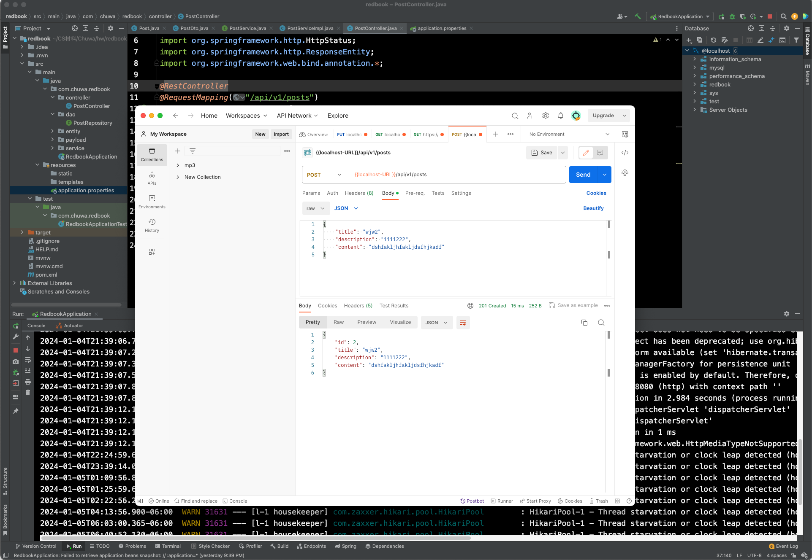

1. In class activity

2. Postman Practice

- API: GET - 1
    > https://restcountries.com/v2/all
  
    > Response status: 200 OK
  
    ```json
    [
    {
        "name": "Afghanistan",
        "topLevelDomain": [
            ".af"
        ],
        "alpha2Code": "AF",
        "alpha3Code": "AFG",
        "callingCodes": [
            "93"
        ],
        "capital": "Kabul",
        "altSpellings": [
            "AF",
            "Afġānistān"
        ],
        "subregion": "Southern Asia",
        "region": "Asia",
        "population": 40218234,
        "latlng": [
            33.0,
            65.0
        ],
        "demonym": "Afghan",
        "area": 652230.0,
        "timezones": [
            "UTC+04:30"
        ],
        "borders": [
            "IRN",
            "PAK",
            "TKM",
            "UZB",
            "TJK",
            "CHN"
        ],
        "nativeName": "افغانستان",
        "numericCode": "004",
        "flags": {
            "svg": "https://upload.wikimedia.org/wikipedia/commons/5/5c/Flag_of_the_Taliban.svg",
            "png": "https://upload.wikimedia.org/wikipedia/commons/thumb/5/5c/Flag_of_the_Taliban.svg/320px-Flag_of_the_Taliban.svg.png"
        },
        "currencies": [
            {
                "code": "AFN",
                "name": "Afghan afghani",
                "symbol": "؋"
            }
        ],
        "languages": [
            {
                "iso639_1": "ps",
                "iso639_2": "pus",
                "name": "Pashto",
                "nativeName": "پښتو"
            },
            {
                "iso639_1": "uz",
                "iso639_2": "uzb",
                "name": "Uzbek",
                "nativeName": "Oʻzbek"
            },
            {
                "iso639_1": "tk",
                "iso639_2": "tuk",
                "name": "Turkmen",
                "nativeName": "Türkmen"
            }
        ],
        "translations": {
            "br": "Afghanistan",
            "pt": "Afeganistão",
            "nl": "Afghanistan",
            "hr": "Afganistan",
            "fa": "افغانستان",
            "de": "Afghanistan",
            "es": "Afganistán",
            "fr": "Afghanistan",
            "ja": "アフガニスタン",
            "it": "Afghanistan",
            "hu": "Afganisztán"
        },
        "flag": "https://upload.wikimedia.org/wikipedia/commons/5/5c/Flag_of_the_Taliban.svg",
        "regionalBlocs": [
            {
                "acronym": "SAARC",
                "name": "South Asian Association for Regional Cooperation"
            }
        ],
        "cioc": "AFG",
        "independent": true
    },
    {
        "name": "Åland Islands",
        "topLevelDomain": [
            ".ax"
        ],
        "alpha2Code": "AX",
        "alpha3Code": "ALA",
        "callingCodes": [
            "358"
        ],
        "capital": "Mariehamn",
        "altSpellings": [
            "AX",
            "Aaland",
            "Aland",
            "Ahvenanmaa"
        ],
        "subregion": "Northern Europe",
        "region": "Europe",
        "population": 28875,
        "latlng": [
            60.116667,
            19.9
        ],
        "demonym": "Ålandish",
        "area": 1580.0,
        "timezones": [
            "UTC+02:00"
        ],
        "nativeName": "Åland",
        "numericCode": "248",
        "flags": {
            "svg": "https://flagcdn.com/ax.svg",
            "png": "https://flagcdn.com/w320/ax.png"
        },
        "currencies": [
            {
                "code": "EUR",
                "name": "Euro",
                "symbol": "€"
            }
        ],
        "languages": [
            {
                "iso639_1": "sv",
                "iso639_2": "swe",
                "name": "Swedish",
                "nativeName": "svenska"
            }
        ],
        "translations": {
            "br": "Åland",
            "pt": "Ilhas de Aland",
            "nl": "Ålandeilanden",
            "hr": "Ålandski otoci",
            "fa": "جزایر الند",
            "de": "Åland",
            "es": "Alandia",
            "fr": "Åland",
            "ja": "オーランド諸島",
            "it": "Isole Aland",
            "hu": "Åland-szigetek"
        },
        "flag": "https://flagcdn.com/ax.svg",
        "regionalBlocs": [
            {
                "acronym": "EU",
                "name": "European Union"
            }
        ],
        "independent": false
    },
    {
        "name": "Albania",
        "topLevelDomain": [
            ".al"
        ],
        "alpha2Code": "AL",
        "alpha3Code": "ALB",
        "callingCodes": [
            "355"
        ],
        "capital": "Tirana",
        "altSpellings": [
            "AL",
            "Shqipëri",
            "Shqipëria",
            "Shqipnia"
        ],
        "subregion": "Southern Europe",
        "region": "Europe",
        "population": 2837743,
        "latlng": [
            41.0,
            20.0
        ],
        "demonym": "Albanian",
        "area": 28748.0,
        "gini": 33.2,
        "timezones": [
            "UTC+01:00"
        ],
        "borders": [
            "MNE",
            "GRC",
            "MKD",
            "UNK"
        ],
        "nativeName": "Shqipëria",
        "numericCode": "008",
        "flags": {
            "svg": "https://flagcdn.com/al.svg",
            "png": "https://flagcdn.com/w320/al.png"
        },
        "currencies": [
            {
                "code": "ALL",
                "name": "Albanian lek",
                "symbol": "L"
            }
        ],
        "languages": [
            {
                "iso639_1": "sq",
                "iso639_2": "sqi",
                "name": "Albanian",
                "nativeName": "Shqip"
            }
        ],
        "translations": {
            "br": "Albania",
            "pt": "Albânia",
            "nl": "Albanië",
            "hr": "Albanija",
            "fa": "آلبانی",
            "de": "Albanien",
            "es": "Albania",
            "fr": "Albanie",
            "ja": "アルバニア",
            "it": "Albania",
            "hu": "Albánia"
        },
        "flag": "https://flagcdn.com/al.svg",
        "regionalBlocs": [
            {
                "acronym": "CEFTA",
                "name": "Central European Free Trade Agreement"
            }
        ],
        "cioc": "ALB",
        "independent": true
    }
  ]
    ```

- API: GET - 2
    > https://api.thedogapi.com/v1/breeds
  
    > Response status：400 Bad Request
    ```html
    <!DOCTYPE html>
    <html lang=en>
    <meta charset=utf-8>
    <meta name=viewport content="initial-scale=1, minimum-scale=1, width=device-width">
    <title>Error 400 (Bad Request)!!1</title>
    <style>
        * {
            margin: 0;
            padding: 0
        }
    
        html,
        code {
            font: 15px/22px arial, sans-serif
        }
    
        html {
            background: #fff;
            color: #222;
            padding: 15px
        }
    
        body {
            margin: 7% auto 0;
            max-width: 390px;
            min-height: 180px;
            padding: 30px 0 15px
        }
    
        *>body {
            background: url(//www.google.com/images/errors/robot.png) 100% 5px no-repeat;
            padding-right: 205px
        }
    
        p {
            margin: 11px 0 22px;
            overflow: hidden
        }
    
        ins {
            color: #777;
            text-decoration: none
        }
    
        a img {
            border: 0
        }
    
        @media screen and (max-width:772px) {
            body {
                background: none;
                margin-top: 0;
                max-width: none;
                padding-right: 0
            }
        }
    
        #logo {
            background: url(//www.google.com/images/branding/googlelogo/1x/googlelogo_color_150x54dp.png) no-repeat;
            margin-left: -5px
        }
    
        @media only screen and (min-resolution:192dpi) {
            #logo {
                background: url(//www.google.com/images/branding/googlelogo/2x/googlelogo_color_150x54dp.png) no-repeat 0% 0%/100% 100%;
                -moz-border-image: url(//www.google.com/images/branding/googlelogo/2x/googlelogo_color_150x54dp.png) 0
            }
        }
    
        @media only screen and (-webkit-min-device-pixel-ratio:2) {
            #logo {
                background: url(//www.google.com/images/branding/googlelogo/2x/googlelogo_color_150x54dp.png) no-repeat;
                -webkit-background-size: 100% 100%
            }
        }
    
        #logo {
            display: inline-block;
            height: 54px;
            width: 150px
        }
    </style>
    <a href=//www.google.com/> <span id=logo aria-label=Google></span></a>
    <p><b>400.</b> <ins>That’s an error.</ins>
    <p>Your client has issued a malformed or illegal request. <ins>That’s all we know.</ins>
    ```
- API: GET - 3
    > http://api.weatherapi.com/v1/current.xml?key={{weatherAPI}}&q=48.8567,2.3508

    > Response status: 200 OK
    ```xml
    <?xml version="1.0" encoding="utf-8"?>
    <root>
    <location>
        <name>Paris</name>
        <region>Ile-de-France</region>
        <country>France</country>
        <lat>48.86</lat>
        <lon>2.35</lon>
        <tz_id>Europe/Paris</tz_id>
        <localtime_epoch>1704563399</localtime_epoch>
        <localtime>2024-01-06 18:49</localtime>
    </location>
    <current>
        <last_updated_epoch>1704563100</last_updated_epoch>
        <last_updated>2024-01-06 18:45</last_updated>
        <temp_c>6</temp_c>
        <temp_f>42.8</temp_f>
        <is_day>0</is_day>
        <condition>
            <text>Light rain</text>
            <icon>//cdn.weatherapi.com/weather/64x64/night/296.png</icon>
            <code>1183</code>
        </condition>
        <wind_mph>10.5</wind_mph>
        <wind_kph>16.9</wind_kph>
        <wind_degree>320</wind_degree>
        <wind_dir>NW</wind_dir>
        <pressure_mb>1015</pressure_mb>
        <pressure_in>29.97</pressure_in>
        <precip_mm>0.08</precip_mm>
        <precip_in>0</precip_in>
        <humidity>87</humidity>
        <cloud>100</cloud>
        <feelslike_c>2.9</feelslike_c>
        <feelslike_f>37.1</feelslike_f>
        <vis_km>10</vis_km>
        <vis_miles>6</vis_miles>
        <uv>1</uv>
        <gust_mph>13.1</gust_mph>
        <gust_kph>21.1</gust_kph>
    </current>
    </root>
    ```
  
- API: GET - 4
  > https://v2.jokeapi.dev/joke/Any?format=txt
  
  > Response status: 200 OK
  
    ```text
    What does tofu and a dildo have in common?

    They're both meat substitutes.
    ```

- API: GET - 5
    > http://placekitten.com/200/300
   
    > Response status: 200 OK
  
    

- API: Post - 1
    > https://httpbin.org/post
  
    > Response status: 200 OK

    - Request Body
        ```json
         {
            "username": "update"
         }
        ```
   ```json
   {
    "args": {},
    "data": "{\n    \"username\": \"update\"\n}",
    "files": {},
    "form": {},
    "headers": {
        "Accept": "*/*",
        "Accept-Encoding": "gzip, deflate, br",
        "Content-Length": "28",
        "Content-Type": "application/json",
        "Host": "httpbin.org",
        "Postman-Token": "dd908bcc-d649-4215-9e06-58c72098d956",
        "User-Agent": "PostmanRuntime/7.35.0",
        "X-Amzn-Trace-Id": "Root=1-6599b717-3d51ab5e604a20e60fd97838"
    },
    "json": {
        "username": "update"
    },
    "origin": "76.191.28.177",
    "url": "https://httpbin.org/post"
    }
   ```

- API: Post - 2
    > https://jsonplaceholder.typicode.com/posts

    > Response status: 201 Created 

    - Request Body

    ```json
    {
    "title": "foo",
    "body": "bar",
    "userId": 1
    }
    ```

    ```json
    {
    "title": "foo",
    "body": "bar",
    "userId": 1
    }
    ```

- API: Post - 3
    > https://reqres.in/api/users

    > Response status: 201 Create

    - Request Body
  
        ```json
        {
          "name": "morpheus",
          "job": "leader"
       }
        ```
    ```json
    {
    "name": "morpheus",
    "job": "leader",
    "id": "991",
    "createdAt": "2024-01-06T20:38:41.827Z"
    }
    ```
- API: Post - 4
   > https://jsonplaceholder.cypress.io/posts
   
   > Response status: 201 Create
  
    ```json
    {
    "name": "morpheus",
    "job": "leader"
    }
    ```

    ```json
    {
    "name": "morpheus",
    "job": "leader",
    "id": 101
    }
    ```
   
- API: Post - 5
    > https://restful-booker.herokuapp.com/auth
   
    > Response status: 200 ok
    
    ```json
     {
       "username" : "admin",
       "password" : "password123"
    }
    ```
    
    ```json
    {
       "token": "ea77da74c5ded7e"
    }
    ```
  
- API: Put - 1
    > https://reqres.in/api/users/2
    
    > Response status: 200 OK
    ```json
    {
    "name": "adm",
    "job": "leader"
    }
    ```
   
    ```json
    {
       "name": "adm",
       "job": "leader",
       "updatedAt": "2024-01-06T21:08:25.509Z"
    }
    ```
- API: Put - 2
    > https://restful-booker.herokuapp.com/booking/1
  
    > Response status: 200 OK
    ```json
    {
    "firstname" : "James",
    "lastname" : "Brown",
    "totalprice" : 111,
    "depositpaid" : true,
    "bookingdates" : {
        "checkin" : "2018-01-01",
        "checkout" : "2019-01-01"
    },
    "additionalneeds" : "Breakfast"
   }
    ```
  
    ```json
    {
    "firstname": "James",
    "lastname": "Brown",
    "totalprice": 111,
    "depositpaid": true,
    "bookingdates": {
        "checkin": "2018-01-01",
        "checkout": "2019-01-01"
    },
    "additionalneeds": "Breakfast"
    }
    ```
- API: Put - 3
    > https://jsonplaceholder.typicode.com/posts/1

    > Response status: 200 OK
    ```json
    {
    "id": 1,
    "title": "foo",
    "body": "bar",
    "userId": 1
    }
    ```
    ```json
  {
  "id": 1,
  "title": "foo",
  "body": "bar",
  "userId": 1
  }
    ```
- API: Delete  - 1
    > https://jsonplaceholder.typicode.com/posts/1
  
    > Response status: 200 OK
- API: Delete  - 2
    > https://reqres.in/api/users/2

    > Response status: 204 No Content


- 204 No Content
    > https://reqres.in/api/users?page=2
- 403 Forbidden
    > https://restful-booker.herokuapp.com/booking/:id

- 500 Internal Server Error
    > https://restful-booker.herokuapp.com/booking

- 404 Not Found
    > https://placeholder.com/api/text/
- 405 Method Not Allowed
    > https://restful-booker.herokuapp.com/booking/:id
  
    > header: cookie:token=
- 401
