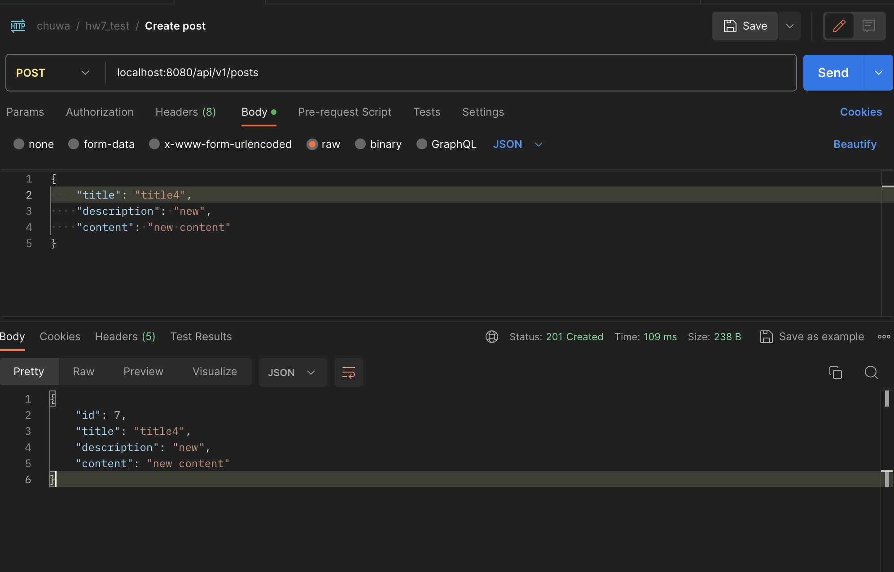

### Common Springboot annotations:
1. **`@SpringBootApplication`**: This is the primary annotation used to mark the main class of a Spring Boot application. It combines `@Configuration`, `@EnableAutoConfiguration`, and `@ComponentScan`, and it's typically placed on the class containing the `main` method.

2. **`@Controller`**: Used to mark a class as a Spring MVC controller, allowing it to handle HTTP requests.

3. **`@RestController`**: Combines `@Controller` and `@ResponseBody`, indicating that the class is responsible for RESTful endpoints and that the response should be serialized as JSON or XML.

4. **`@Service`**: Marks a class as a service or business logic component that should be managed by the Spring container.

5. **`@Repository`**: Indicates that a class is a data repository, typically used for database access operations. It is also a specialization of `@Component`.

6. **`@Component`**: Marks a class as a Spring-managed component, allowing it to be automatically detected and instantiated by the Spring container.

7. **`@Autowired`**: Used for automatic dependency injection. It can be applied to fields, constructors, or methods to inject dependencies into your beans.

8. **`@Qualifier`**: Specifies a qualifier when multiple beans of the same type are available for injection.

9. **`@Value`**: Injects values from properties files or environment variables into bean fields or constructor parameters.

10. **`@RequestMapping`**: Maps HTTP requests to methods in a controller. It's used to specify the URI and HTTP method for which a controller method should respond.

11. **`@PathVariable`**: Extracts values from the URI path and binds them to method parameters.

12. **`@RequestParam`**: Retrieves query parameters from the request and binds them to method parameters.

13. **`@RequestBody`**: Binds the body of an HTTP request to a method parameter, typically used for handling JSON or XML payloads.

14. **`@ResponseBody`**: Indicates that a method should return the response body directly, without view resolution, useful for RESTful endpoints.

15. **`@Entity`**: Indicates a class should represents a database table. 

16. **`@UniqueConstraint(columnNames = {"title"})`** specifies that there is a unique constraint on the "title" column. This means that the values in the "title" column must be unique across all rows in the "posts" table.
---

2. ### explain how the below annotaitons specify the table in database?
```java
@Column(columnDefinition = "varchar(255) default 'John Snow'")
private String name;
  
@Column(name="STUDENT_NAME", length=50, nullable=false, unique=false)
private String studentName;
```

-  The `name` column is a string. It can have at most 255 characters. Its default value is 'John Snow'.
- The `studentName` column is a string. Its column name in the corresponding table in the database is 'STUDENT_NAME'. Its max length is 50. It cannot be null. It doesn't need to be unique.

3. ### What is the default column names of the table in database for  @Column ?
- The default of column name for @Column is ""(empty string), which is specified in the source code.
```java
public @interface Column {
    /**
     * (Optional) The name of the column. Defaults to 
     * the property or field name.
     */
   String name() default "";
}
```

4. ### What are the layers in springboot application? what is the role of each layer?
- Presentation Layer
- Business Layer
- Persistence Layer (Storage logic)
- Database
- 

5.  ### Describe the flow in all of the layers if an API is called by Postman.

- Postman sends an HTTP request to an API endpoint.
- The controller receives and processes the request.
- The controller invokes service methods for business logic.
- Service classes contain business logic and may interact with repositories.
- Repositories handle database interactions.
- Data is queried or mutated in the database.
- The controller prepares and sends an HTTP response back to Postman.

6.  ### What is the application.properties? do you know application.yml?

- Application.properties is a properties file format, where configurations are defined as key-value pairs. 
- This is a YAML (YAML Ain't Markup Language) format, which uses indentation to represent data structures. It is more human-readable than properties files and is often preferred for complex configurations. Eample:
```yaml
server:
  port: 8080
spring:
  datasource:
    url: jdbc:mysql://localhost:3306/mydb
```

---
### Springboot POST API screenshot

