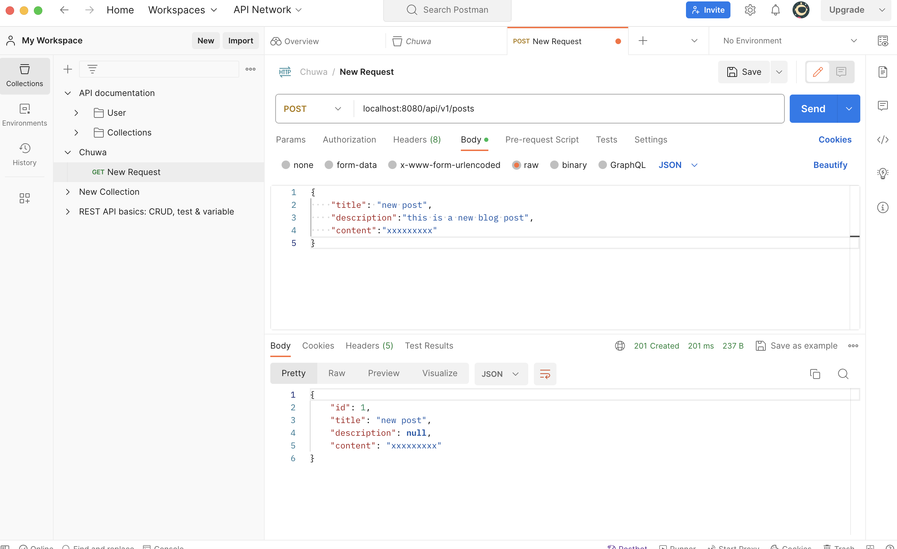
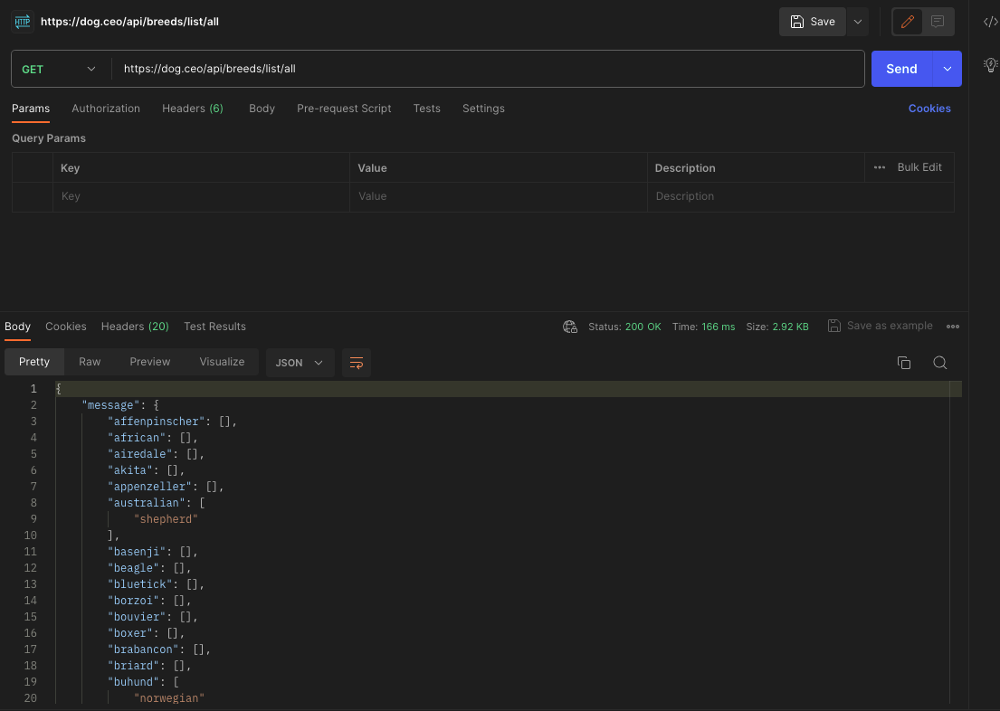
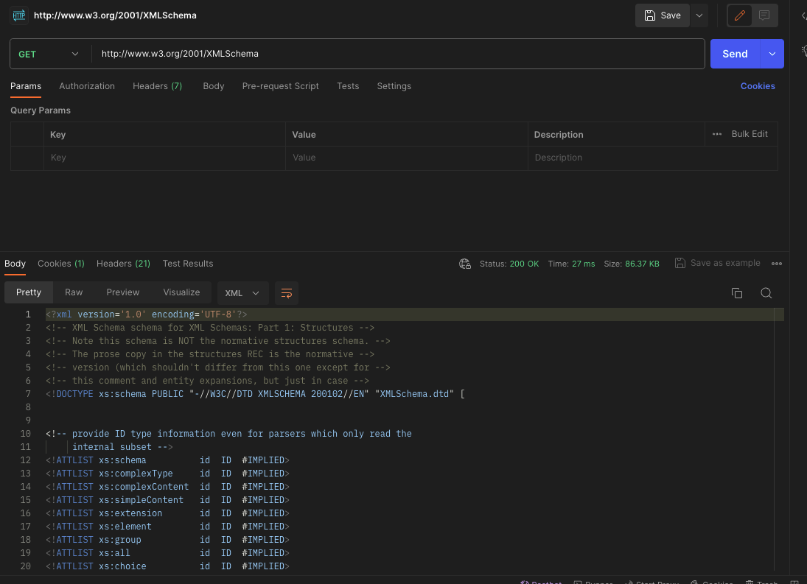
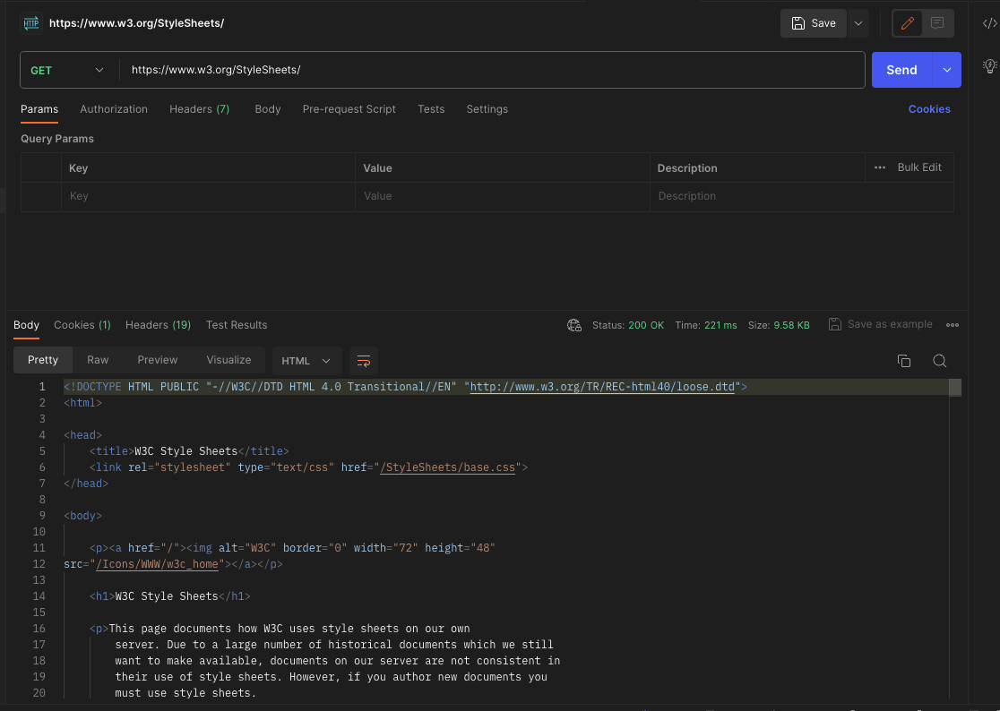
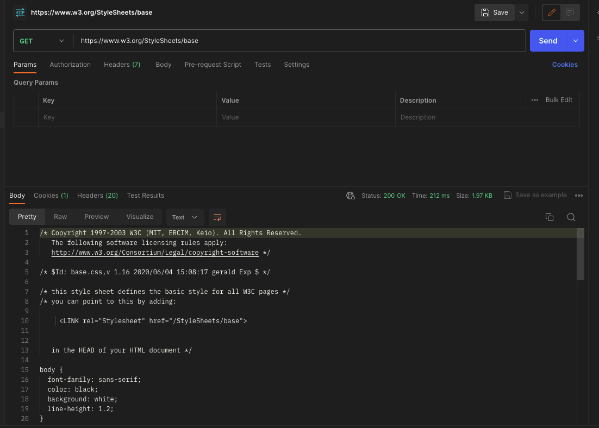
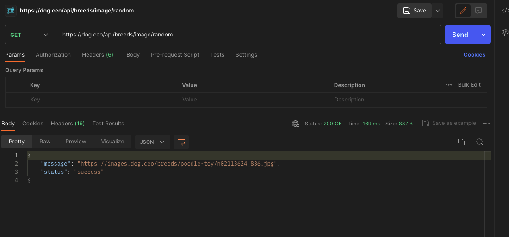

## HW7

#### POST API in class


#### SpringBoot annotations
[annotation.md](./annotation.md)

#### Mongo blog
[Mongo blog project](../MavenProject/mongo-blog/)

#### Explanation of `@Column` annotations:
```Java
@Column(columnDefinition = "varchar(255) default 'John Snow'")
private String name;

@Column(name="STUDENT_NAME", length=50, nullable=false, unique=false)
private String studentName;
```

The annotation specifies the column in the database table for the `name` field should have a definition of varchar(255) with a default value of 'John Snow'.

For the field `studentName`, the annotation specifies that the column name should be "STUDENT_NAME", with the maximum length of data to be 50 characters, the column values cannot be null and they can be not unique.

#### Default column names for `@Column`
```Java
@Column
private String firstName;
@Column
private String operatingSystem;
```
If the name attribute is not specified in the `@Column` annotation, the default column names will be derived from the field names. In this case, the default column names in the database would be "firstName" and "operatingSystem" respectively.

#### Layers in a Spring Boot application and their roles
- Controller Layer: Handles incoming HTTP requests, processes them, and returns an appropriate response. It delegates business logic to the service layer.

- Service Layer: Contains business logic and application-specific functionality. It interacts with the repository layer (data access) to perform operations.

- Repository (Data Access) Layer: Deals with database operations, including CRUD operations. It communicates with the database to store and retrieve data.

- Model Layer: Represents the data structure and business entities. It often includes entities or POJOs (Plain Old Java Objects).

#### Flow in all layers when an API is called by Postman
Postman (Client): Sends an HTTP request to the specified API endpoint.

Controller Layer: Receives the HTTP request, processes it, and delegates the request to the service layer.

Service Layer: Contains the business logic. It performs necessary operations, which may include interacting with the repository layer.

Repository (Data Access) Layer: Performs database operations if needed, like storing or retrieving data.

Model Layer: Represents the data and entities used in the application.

Response Flow: The response flows back through the layers in the reverse order. The service layer sends the response to the controller, which, in turn, sends the HTTP response back to Postman.

#### application.properties and application.yml
`application.properties` is a file to configure properties in a Spring Boot application. It stores application-level properties in a `key-value format`.
`application.yml` is a yaml file serving for properties configuration as well in `YAML format`. It's an alternative to `application.properties `and is often preferred for its simplicity and readability.

#### Postman Practices

##### 5 GET APIs with different response type
- JSON response
  
- XML response
  
- HTML response
  
- Text/Plain response
    
- Image response
  

##### 5 Post API with json request body, please also paste the response here

POST https://jsonplaceholder.typicode.com/users/1/todos
Request Body:
```
{
    "userId":3,
    "title":"a title",
    "completed": true

}
```

Response:
```
{
    "userId": "1",
    "title": "a title",
    "completed": true,
    "id": 201
}
```

POST https://jsonplaceholder.typicode.com//users/1/albums
Request Body:
```
{
    "userId":3,
    "title":"bew album"

}
```
Response:
```
{
    "userId": "1",
    "title": "bew album",
    "id": 101
}
```

##### 3 PUT API with json request body, please also paste the response here

PUT https://my-json-server.typicode.com/typicode/demo/posts/1
Request Body:
```
{
    "title": "Post 1"

}
```
Response:
```
{
    "id": 1,
    "title": "Post 1"

}
```

PUT https://my-json-server.typicode.com/typicode/demo/comments/2
Request Body:
```
{
    "body": "some comment",
    "postId": 1
}
```
Response:
```
{
    "id": 2,
    "body": "some comment",
    "postId": 1
}
```

##### 2 DELETE API
DELETE https://my-json-server.typicode.com/typicode/demo/comments/2
Request Body:N/A
Response:
```
{}
```

DELETE https://my-json-server.typicode.com/typicode/demo/posts/1
Request Body:N/A
Response:
```
{}
```
##### Each example with 404, 401,500 and any http status codes you know
- 400 Bad Request
- 404 Not Found
- 401 Unauthorized
- 405 Method not allowed
- 500 Internal server error