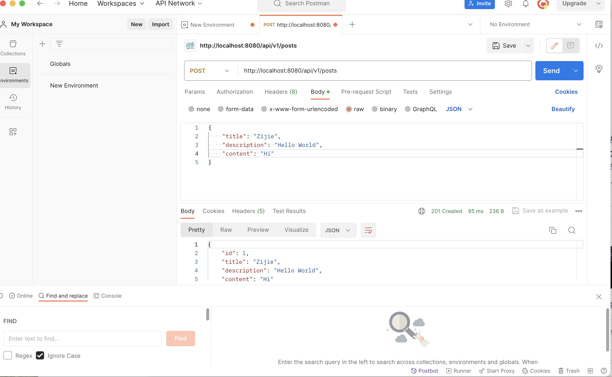
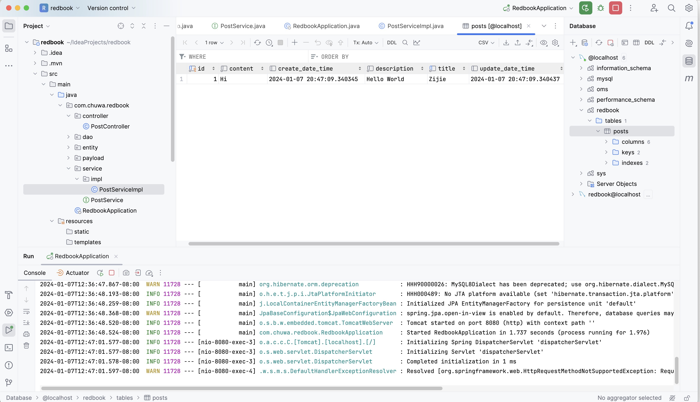

# Before

# 1

create a file to list all of the annotaitons you learned and known, and explain the usage and how do you understand it. you need to update it when you learn a new annotation. Please organize those annotations well, like annotations used by entity, annotations used by controller.

Finished, please check root directory: annotations.md

# 2

explain how the below annotaitons specify the table in database?

1. `@Column(columnDefinition = "varchar(255) default 'John Snow'") private String name;`
   - `@Column`: Maps the Java field to a database column.
   - `columnDefinition`: Sets the column type to `varchar(255)` with a default value of 'John Snow'.
   - `private String name;`: The Java field linked to the column.
2. `@Column(name="STUDENT_NAME", length=50, nullable=false, unique=false) private String studentName;`
   - `@Column`: Annotation for mapping the field to a database column.
   - `name="STUDENT_NAME"`: Column named `STUDENT_NAME`.
   - `length=50`: Maximum length of 50 characters.
   - `nullable=false`: Column can't be null.
   - `unique=false`: Allows duplicate values.
   - `private String studentName;`: Java field for the column.

# 3

What is the default column names of the table in database for `@Column`?

the default column name in the database is typically the same as the field name in your Java class,

# 4

What are the layers in springboot application? what is the role of each layer?

1. **Controller Layer**:
   - **Role**: Handles HTTP requests from clients. This layer is responsible for processing incoming REST API requests, preparing a model, and returning the response. It's typically annotated with `@RestController` or `@Controller` in Spring Boot.
2. **Service Layer**:
   - **Role**: Contains business logic. The service layer is responsible for executing specific business rules or functions. It acts as a transaction boundary and may involve calling methods in the repository layer. Services are usually annotated with `@Service`.
3. **Repository (or DAO) Layer**:
   - **Role**: Handles data access. This layer is responsible for interacting with the database to save and retrieve data. It typically uses Spring Data JPA or similar frameworks and is often annotated with `@Repository`.
4. **Model (or Domain) Layer**:
   - **Role**: Represents the data and business rules. In this layer, you define entity classes that map to database tables (when using ORM tools like Hibernate). It represents the state and behavior of the data in your application.
5. **DTO (Data Transfer Object) Layer** (optional but commonly used):
   - **Role**: Transfers data between processes. DTOs are used to encapsulate data and separate how data is transmitted over the network from your internal domain model.
6. **Configuration Layer**:
   - **Role**: Configures the beans and application settings. This layer usually includes configuration classes annotated with `@Configuration`, which configure the beans and other settings in the Spring Context.

# 5

Describe the flow in all of the layers if an API is called by Postman.

1. **Postman Request**: A request is sent from Postman to the Spring Boot application.
2. **Controller Layer**: Receives the HTTP request and directs it to the appropriate service method.
3. **Service Layer**: Processes the business logic and interacts with the Repository layer for data operations.
4. **Repository Layer**: Handles data access and retrieval from the database.
5. **Service Layer**: Receives processed data from the Repository and performs any final business logic.
6. **Controller Layer**: Prepares and sends the response back to Postman.

# 6

What is the application.properties? do you know application.yml?

- `application.properties` is a Spring Boot configuration file with `key=value` format.
- `application.yml` is an alternative using YAML format, allowing more structured and readable configurations.

# 7

I created a MongoDB server using Docker locally. 

The file you can find at this path: chuwa1206/CodingQuestions/hw7/mongo-blog

