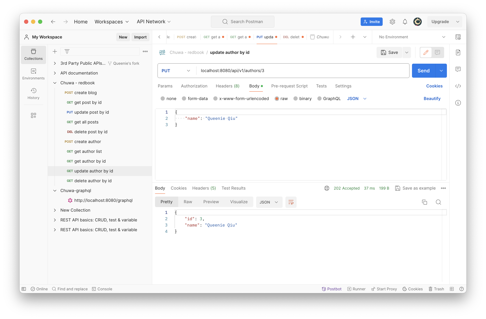

## HW8

#### Redbook applications
[Project Repo](../MavenProject/redbook/)
Proofs of running:



#### How to debug?
1. Locate the bug by looking at the error massage, also based on error msg get a basic idea of what the bug is about. e.g nullPointerException
2. Set breakpoints and run in debug mode to go through the logic and inspect the variable values.

#### DTO, VO, Payload, DO, Model:
`DTO (Data Transfer Object):`
A DTO is an object that carries data between processes. It is used to encapsulate data and send it from one subsystem of an application to another.

`VO (Value Object):`
Similar to a DTO, a Value Object represents an object that contains attributes but has no conceptual identity. It is usually immutable.

`Payload:`
In the context of web development or APIs, a payload is the data transmitted as part of a request or response. It can be in the form of JSON, XML, or other formats.

`DO (Data Object):`
Often used in the context of data access or persistence layers. A Data Object represents an object that carries data between processes or between a database and the application.

`Model:`
In the context of Spring MVC, the term "Model" typically refers to the data that is exposed to the view. It may include DTOs, domain objects, or other structures that the view needs to render.

#### Jackson
Jaskson is a library for JSON processing. It provides a set of annotations and a powerful data-binding mechanism to serialize and deserialize Java objects to and from JSON.

#### @JsonProperty("description_yyds")
JsonProperty is an annotation fron the Jackson library that customizes the mapping between Java objects and JSON properties. It means to serialize the associated Java object to JSON and name it to be "description_yyds".

#### spring-boot-stater
A starter is a pre-packaged set of dependencies and configurations that helps you bootstrap a specific type of application quickly. The spring-boot-starter is the parent of all starters and includes the common dependencies needed for any Spring Boot application.

Example of starters:
- spring-boot-starter-data-jpa
- spring-boot-starter-graphql
- spring-boot-starter-web
- spring-boot-starter-test
    
##### Dependencies in spring-boot-starter-web:
The `spring-boot-starter-web` is a starter for building web applications with Spring MVC. It includes dependencies related to web development, such as:

`Spring MVC`: The core of the Spring MVC framework for building web applications.
`Embedded Web Server`: A lightweight embedded web server (like Tomcat, Jetty, or Undertow).
`Spring Boot Auto-Configuration`: Pre-configured settings to simplify the setup of a Spring Boot web application.

#### @RequestMapping(value = "/users", method = RequestMethod.POST) and CRUD Operations
It is an annotation that map a class or method to HTTP requests. It specifies the path varibale to be "/users", and http methods to be POST.

@RequestMapping(value = "/users", method = RequestMethod.GET)
@RequestMapping(value = "/users/{id}", method = RequestMethod.PUT)
@RequestMapping(value = "/users/{id}", method = RequestMethod.PATCH)
@RequestMapping(value = "/users/{id}", method = RequestMethod.DELETE)

#### What is ResponseEntity and why do we need it?
`ResponseEntity` is a class in Spring Framework that represents the entire HTTP response. It can be used to customize the HTTP response status, headers, and body. It allows more fine-grained control over the response compared to returning a simple object.

#### What is ResultSet in JDBC? Describe the flow of getting data using JDBC
`ResultSet` is an interface in Java that provides methods to retrieve data from a database query result set. It represents the data retrieved after executing a SELECT statement.

##### Flow of Getting Data using JDBC:

1. Establish a Connection to the database
2. Create a statement
3. Execute Query using the Statement.executeQuery(sql) method, which returns a ResultSet
4. Retrieve Data
5. Close the ResultSet, Statement, and Connection to release resources.

#### What is the ORM framework
ORM stands for `Object-Relational Mapping`. It is a programming technique that converts data between relational databases and object-oriented programming languages.

#### Serialization and desrialization
Data serialization is the process of converting an object into a stream of bytes to more easily save or transmit it.

The deserialization process constructs a data structure or object from a series of bytes and recreates the object, thus making the data easier to read and modify as a native structure in a programming language.

#### Use stream api to get the average of the array [20, 3, 78, 9, 6, 53, 73, 99, 24, 32]
```Java
public class Test {

    private static double calculate() {
        int[] arr = new int[]{20, 3, 80, 1, 4, 21, 6};
        double sum = Arrays.stream(arr).average().orElse(0.0);
        return sum;
    }
    public static void main(String[] args) {
        System.out.println(calculate());
    }
}
```