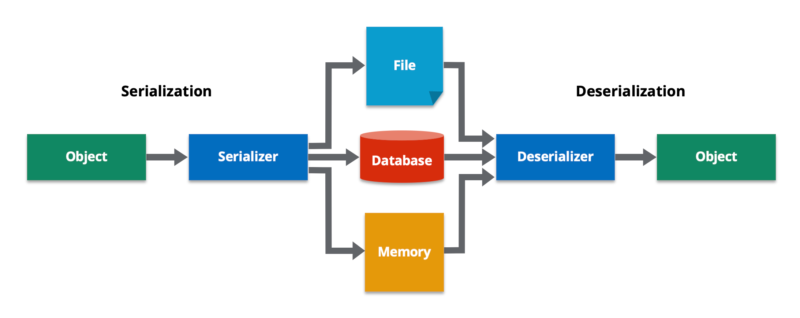

1. how do you do the debug?
   - Set Up Your Project:
   - Configure the Application for Debugging:
   - Enable Debugging:
   - Run in Debug Mode:
   - Debugging Tools:
   - Monitor Logs:
   - Stopping the Debug Session:

2. What is DTO, VO, Payload, DO, model?
   - DTO (Data Transfer Object):
     - In Spring Boot, DTOs are commonly used to transfer data between layers of an application or between the client and server. They are lightweight objects that carry data without containing any business logic. 
     - DTOs are often employed to encapsulate the data exchanged through API requests and responses.
   - VO (Value Object):
     - While Spring Boot does not explicitly use the term "VO" (Value Object), the concept of using objects to represent values in a domain is consistent with object-oriented programming principles
     - In software engineering, a Value Object (VO) is an object that represents a value or concept in the domain of the application. Unlike an entity, a value object has no identity and is immutable 1. It is used to encapsulate a group of related attributes and is often used to represent a single concept.
   - Payload:
     - In the context of Spring Boot's RESTful APIs, the term "Payload" is often used to refer to the data that is sent in the request or response body. This includes JSON or XML data exchanged between clients and servers.
     - Spring Boot provides annotations like @RequestBody and @ResponseBody to handle and map payloads in controller methods.
   - DO (Domain Object):
     - Domain Objects in Spring Boot represent entities within the application's domain. These objects encapsulate business logic and interact with the database.
     - Entities annotated with @Entity in Spring Data JPA are examples of Domain Objects. They are typically used to model and persist data in a relational database.
   - Model:
     - In Spring Boot, the term "Model" is often associated with the Model-View-Controller (MVC) architecture. The Model represents the application's data and business logic.
     - Spring MVC uses the Model interface to pass data between the controller and the view in web applications.

3. What is @JsonProperty("description_yyds")
   - @JsonProperty is an annotation used in the Jackson library to map a JSON property to a Java field during serialization and deserialization.
   - In the code snippet you provided, @JsonProperty("description_yyds") is used to map the JSON property description_yyds to a Java field. This means that when the JSON object is deserialized, the value of the description_yyds property will be assigned to the corresponding Java field.

4. Do you know what is jackson?
   ```java
   <dependency>
   <groupId>com.fasterxml.jackson.core</groupId>
   <artifactId>jackson-databind</artifactId>
   <version>2.13.3</version>
   <scope>compile</scope>
   </dependency>
   ```
   - Jackson is a high-performance JSON processor library for Java. It provides data-binding functionality for JSON processing, allowing you to convert JSON data to Java objects and vice versa.
   - The jackson-databind dependency is a part of the Jackson library and provides data-binding functionality for JSON processing. It allows you to convert JSON data to Java objects and vice versa.

5. What is spring-boot-stater?
   - is a set of convenient dependency descriptors that you can include in your application. It provides a one-stop-shop for all the Spring and related technology that you need, without having to hunt through sample code and copy-paste loads of dependency descriptors.
   - what dependecies in the below starter? do you know any starters?
      ```java
      <dependency>
      <groupId>org.springframework.boot</groupId>
      <artifactId>spring-boot-starter-web</artifactId>
      </dependency>
      ```
      - `spring-boot-starter-web` is one of the starters that provides a convenient way to include all the dependencies required for building a web application. It includes the following dependencies:
        - `spring-boot-starter`: Core starter, including auto-configuration support, logging, and YAML.
        - `spring-boot-starter-tomcat`: Starter for using Tomcat as the embedded servlet container.
        - `spring-boot-starter-validation`: Starter for using Java Bean Validation with Hibernate Validator.
        - `com.fasterxml.jackson.core`:jackson-databind: Jackson data-binding functionality.
        - `org.springframework:spring-web`: Spring Web MVC and REST.
        - `org.springframework:spring-webmvc`: Spring Web MVC.

6. do you know @RequestMapping(value = "/users", method = RequestMethod.POST) ? could you list
   CRUD by this style?
    > @RequestMapping is an annotation used in Spring MVC to map web requests to Spring Controller methods. The value attribute of @RequestMapping specifies the URL path to which the method should respond. The method attribute specifies the HTTP method that the method should respond to. In the code snippet you provided, @RequestMapping(value = "/users", method = RequestMethod.POST) maps the HTTP POST method to the /users URL path.
   - Create: @RequestMapping(value = "/users", method = RequestMethod.POST): This maps the HTTP POST method to the /users URL path, which can be used to create a new user.
   - Read: @RequestMapping(value = "/users/{id}", method = RequestMethod.GET): This maps the HTTP GET method to the /users/{id} URL path, which can be used to retrieve the details of a specific user.
   - Update: @RequestMapping(value = "/users/{id}", method = RequestMethod.PUT): This maps the HTTP PUT method to the /users/{id} URL path, which can be used to update the details of a specific user.
   - Delete: @RequestMapping(value = "/users/{id}", method = RequestMethod.DELETE): This maps the HTTP DELETE method to the /users/{id} URL path, which can be used to delete a specific user.

7. What is ResponseEntity? why do we need it?
   ```java
   new ResponseEntity<>(postResponse, HttpStatus.OK);
   new ResponseEntity<>(postResponse, HttpStatus.CREATED);
   ResponseEntity.ok(postService.getPostById(id));
   ```

   - `ResponseEntity` is a class in the Spring Framework that represents an HTTP response, including headers, body, and status. It provides methods to easily manipulate and handle response data.
   - `ResponseEntity` is useful when you need to customize the HTTP response beyond what is provided by the default Spring MVC behavior. For example, you can use it to set custom headers, cookies, or status codes. It also allows you to return different types of responses based on the request, such as JSON or XML.

8. What is ResultSet in jdbc? and describe the flow how to get data using JDBC.

   - In JDBC (Java Database Connectivity), a `ResultSet` is an interface provided by Java to represent the result set of a database query. It acts as a pointer that points to the current row of data in the result set, and it provides methods to retrieve data from the rows.

   - The flow how to get data using JDBC:

     1. **Load JDBC Driver:**

     2. **Establish Database Connection:**

        ```java
        Connection connection = DriverManager.getConnection("jdbc:mysql://localhost:3306/your_database", "username", "password");
        ```

        3. **Create Statement:**

           ```java
           Statement statement = connection.createStatement();
           ```

     4. **Execute Query:**

        ```java
        ResultSet resultSet = statement.executeQuery("SELECT * FROM your_table");

     5. **Retrieve Data from ResultSet:**

        ```java
        while (resultSet.next()) {
            String columnName = resultSet.getString("column_name");
            // Process the retrieved data
        }
        ```

     6. **Close Resources:**

        ```java
        resultSet.close();
        statement.close();
        connection.close();
        ```

9. What is the ORM framework?

   - Is a technique that allows you to query and manipulate data from a database using an object-oriented paradigm. It provides a way to map between objects in your code and the tables in a relational database.

10. What is the serialization and desrialization?

    - serialization: converting a **data object** into a **series of bytes** that saves the state of the object in an easily transmittable form.
    - desrialization: constructing a data structure or object from a series of bytes
    
11. Learn how to use ObjectMapper by this example.
    - MavenProject -> api -> FoodOutLetJackson

12. use stream api to get the average of the array [20, 3, 78, 9, 6, 53, 73, 99, 24, 32].

    - CodingQuestion -> GetAvgByStream.java