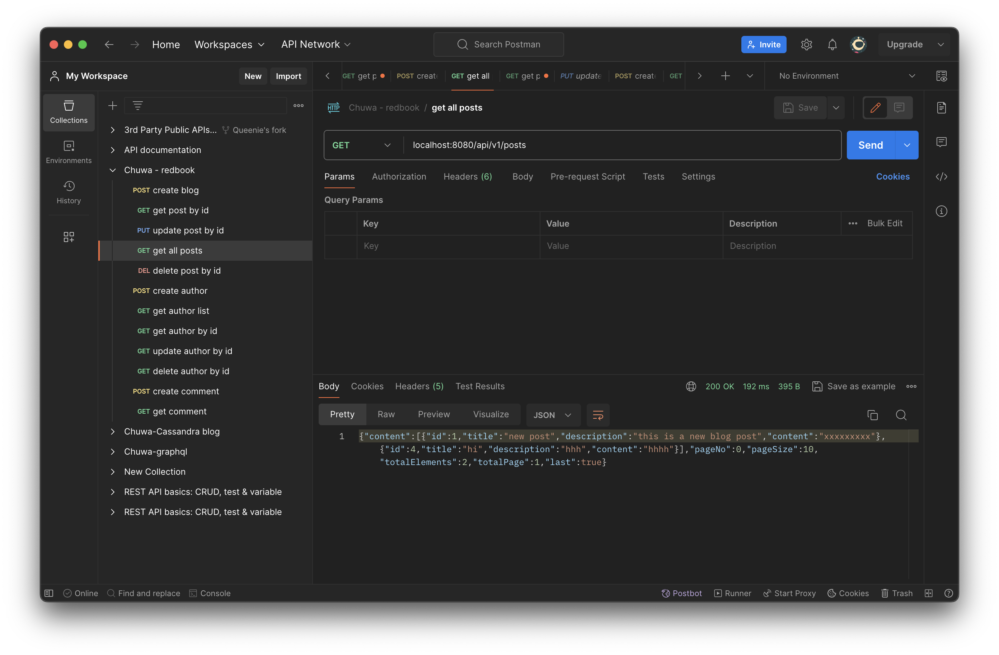
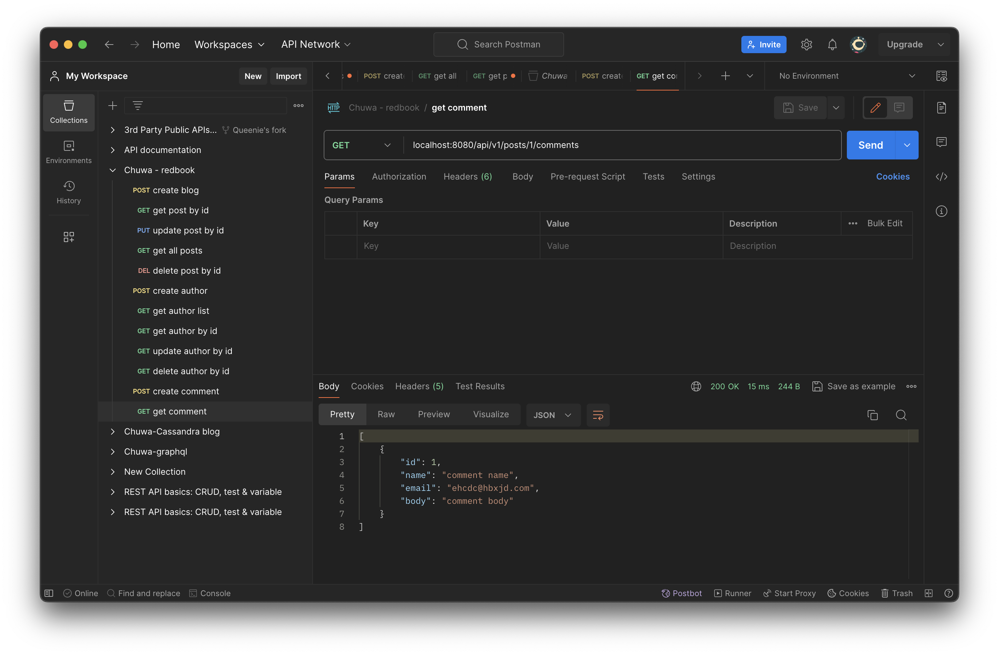

 ## HW9
 
#### Type out the code for the Comment feature of the class project. In postman, call all of the APIs in PostController and CommentController.

Examples:




#### What is JPA? and what is Hibernate?
JPA is a Java specificiation for Object Relational Mapping(ORM) and data management.
Hibernate is a popular implementation for JPA that provides an ORM (Object-Relational Mapping) framework for Java applications.
  
#### What is Hiraki? What is the benefits of connection pool?
HikariCP is a high-performance JDBC connection pool.
Connection pooling enhances performance by reusing existing database connections instead of creating new ones, reducing the overhead of connection creation.

#### @OneToMany, @ManyToOne, @ManyToMany? write some examples.
They are JPA annotations used to define relationships between entities.
Examples:
@OneToMany: One post has many comments.
@ManyToOne: Many comments belong to one post.
@ManyToMany: Many posts can be associated with many tags.

#### cascade = CascadeType.ALL, orphanRemoval = true?
`cascade = CascadeType.ALL`: Specifies that all operations (persist, remove, refresh, merge, detach) should be cascaded.
`orphanRemoval = true`: Removes child entities when they are no longer referenced by the parent.
are the other CascadeType and their features? In which situation we choose which one?
`Other Cascade types:`
CascadeType.PERSIST
CascadeType.MERGE
CascadeType.REFRESH
CascadeType.DETACH
CascadeType.REMOVE

#### FetchType
`fetch = FetchType.LAZY:` Loads the related entities lazily (on-demand).
`fetch = FetchType.EAGER:` Loads the related entities eagerly (immediately).

#### What is the rule of JPA naming convention? Shall we implement the method by ourselves? Could you list some examples?
We don't need to implement the methods manually as they are done by JPA. 

Naming conventions:

1. Query Method Keywords:

`findBy:` Used to indicate query methods for retrieving entities based on a specific attribute.
`getBy`: Similar to findBy.
`readBy:` Similar to findBy.
`queryBy:` Similar to findBy.
`searchBy:` Similar to findBy.
`countBy:` Used to count entities based on a specific attribute.
`deleteBy:` Used to delete entities based on a specific attribute.
 
2. Property Expressions:
After the findBy or other keywords, you specify the entity attribute you want to query.
Use camelCase for property names.

3. Logical Operators:
Use And, Or, Between, LessThan, GreaterThan, etc., to combine conditions.
`For example:` findByFirstNameAndLastName, findByAgeLessThan, findByStartDateBetween, etc.

4. Ordering Results:
Use OrderBy followed by the property name for sorting.
`For example:` findByLastNameOrderByFirstNameAsc.
Limiting Results:

5. Use First, Top, or Distinct to limit the number of results.
`For example:` findFirstByOrderByCreatedDateDesc, findTop5ByOrderBySalaryDesc, etc.

#### What is JPQL
JPQL (Java Persistence Query Language) is a query language for JPA.

#### What is @NamedQuery and @NamedQueries?

`@NamedQuery `and `@NamedQueries` are annotations in JPA (Java Persistence API) that allow you to define named queries at the `entity level`. Named queries provide a way to pre-define JPQL (Java Persistence Query Language) queries for entities, and you can refer to these queries using their names in your code.
They are used together with `EntityManager`

#### What is @Query? In which Interface we write the sql or JPQL?
The @Query` annotation in JPA (Java Persistence API) is used` to declare native SQL queries or JPQL (Java Persistence Query Language) queries directly within a `Spring Data repository interface`. It allows you to define custom queries that are not covered.

When using native SQL, set the nativeQuery to be true.

```Java
public interface UserRepository extends JpaRepository<User, Long> {
    // JPQL
    @Query("SELECT u FROM User u WHERE u.username = :username")
    List<User> findByUsername(@Param("username") String username);

    // native SQL
    @Query(value = "SELECT * FROM users WHERE username = :username", nativeQuery = true)
    List<User> findByUsername(@Param("username") String username);


}

```

#### What is HQL and Criteria Queries?
`HQL`: Hibernete Query Language
####   What is EnityManager?
The EntityManager is a core interface in JPA that provides a set of methods for performing basic operations on entities within a persistence context. It acts as a bridge between your application and the underlying database, allowing you to interact with and manage persistent entities.

####  What is SessionFactory and Session?
Session manages the connection between database and its clients. SessionFactory is the factory mode of producing sessions.

###  What is Transaction? how to manage your transaction?

A transaction in the context of a database is a series of one or more operations that are executed as a single unit of work. It will commit the data to database when all operations in the transaction are successful, othereise they will be rollback.

####  What is hibernate Caching?
It is the caching strategy of hibernate that store the query response into caches to reduce database queries.

#### What is the difference between first-level cache and second-level cache?
First level cache is in session so that it can be accessed by individual session while second-level cache is in the sessionFactory so that the data is shared by all sessions.

####  How do you understand @Transactional? (https://github.com/TAIsRich/tutorial-transaction)
It is an annotation in the Spring framework that manages transaction, and is used to indicate that a method (or all methods of a class) should be executed within a transactional context.